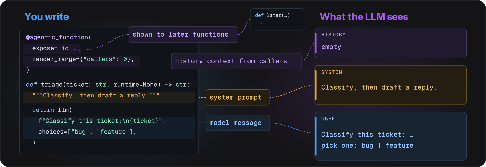

<p align="center">
  <picture>
    <source media="(prefers-color-scheme: dark)" srcset="docs/images/logo-lockup.gif">
    <source media="(prefers-color-scheme: light)" srcset="docs/images/logo-lockup-light.gif">
    
  </picture>
</p>

<p align="center">
  <b>Self-Programming AI Assistant. Capture, automate, and refine all your workflows.</b>
</p>

<p align="center">
  <a href="https://arxiv.org/abs/2606.15874"></a>
  <a href="https://github.com/fzkuji-neo/OpenProgram/releases/latest"></a>
  <a href="https://github.com/fzkuji-neo/OpenProgram/blob/main/LICENSE"></a>
  <a href="https://www.python.org/"></a>
  
  <a href="https://github.com/fzkuji-neo/OpenProgram/actions/workflows/ci.yml"></a>
</p>

<p align="center">
  <a href="docs/start/GETTING_STARTED.md">Getting Started</a> &middot;
  <a href="docs/install/install.md">Install</a> &middot;
  <a href="docs/README.md">Docs</a> &middot;
  <a href="docs/reference/API.md">API Reference</a> &middot;
  <a href="docs/capabilities/agentic-programming/philosophy.md">Philosophy</a> &middot;
  <a href="docs/README.zh.md">中文</a>
</p>

---

> *"The more constraints one imposes, the more one frees oneself."*
> — **Igor Stravinsky**, *Poetics of Music*

**We propose _Agentic Programming_.** An LLM is flexible; code is deterministic. Let the model run everything and you get chaos — unpredictable execution, context explosion, no output guarantees; hard-code everything and you lose the intelligence. A **harness** balances the two, interleaved moment to moment — **Python for the flow you want fixed, the LLM for the judgement you can't script.** ([the full rationale →](docs/capabilities/agentic-programming/philosophy.md))

**Contents**

- [Install](#install)
- [Quick start](#quick-start)
- [Integrated Projects](#integrated-projects)
- [News](#news)
- [Why OpenProgram?](#why-openprogram)
  - [1. Agentic Function — the primitive everything else is built on](#1-agentic-function--the-primitive-everything-else-is-built-on)
  - [2. DAG Context — for native multi-agent systems](#2-dag-context--for-native-multi-agent-systems)
  - [3. Agentic Workflow — for trustworthy & self-evolving agents](#3-agentic-workflow--for-trustworthy--self-evolving-agents)
  - [4. Event Infrastructure — for proactive agents](#4-event-infrastructure--for-proactive-agents)
- [Also in the product](#also-in-the-product)
- [Citation](#citation)
- [License](#license)
- [Acknowledgements](#acknowledgements)

## Install

```bash
curl -fsSL https://openprogram.io/install | sh
```

Windows x86_64 or arm64 CLI/server (requires a release with Windows runtime assets):

```powershell
irm https://openprogram.io/install.ps1 | iex
```

If the selected release has no Windows runtime ZIP and checksum, use the [Windows source-development installation](docs/install/install.md#development-checkout).

Desktop: macOS releases use the signed and notarized DMG; Windows uses a signed `win-x64.exe` or `win-arm64.exe` when that artifact is attached to the [GitHub Release](https://github.com/fzkuji-neo/OpenProgram/releases). Linux and Windows without that EXE use the complete CLI/server runtime and Web UI.

Platform matrix, PATH, `openprogram doctor`, and source-checkout install: **[Installation](docs/install/install.md)**.

## Quick start

The first `openprogram` run opens a provider setup wizard, then the terminal chat. Re-run the wizard with `openprogram setup`.

```bash
openprogram
```

Open the Web UI at http://localhost:18100:

```bash
openprogram web
```

Confirm with one printed reply:

```bash
openprogram --print "Introduce yourself in one sentence"
```

Details: [Getting Started](docs/start/GETTING_STARTED.md).

## Integrated Projects

Our open-source projects cover desktop automation, research workflows, and agent memory. Visit their repositories for source code, documentation, and contributions.

| Project | What it does |
|---|---|
| [GUI&nbsp;Agent&nbsp;Harness](https://github.com/Fzkuji/GUI-Agent-Harness) | **GUI&nbsp;Automation**<br>Operates&nbsp;desktop&nbsp;apps&nbsp;with&nbsp;screenshots&nbsp;and&nbsp;actions. |
| [Research&nbsp;Agent&nbsp;Harness](https://github.com/Fzkuji/Research-Agent-Harness) | **Research&nbsp;Automation**<br>Automates&nbsp;literature&nbsp;reviews,&nbsp;experiments,&nbsp;and&nbsp;paper&nbsp;drafts. |
| [Scriptorium](https://github.com/Fzkuji/Scriptorium) | **Agent&nbsp;Memory**<br>Stores&nbsp;and&nbsp;retrieves&nbsp;source-cited&nbsp;Markdown&nbsp;memories&nbsp;via&nbsp;MCP. |

Install more: `openprogram programs install <owner>/<repo>` ([guide](docs/capabilities/installing-harnesses.md)).

## News

- **2026-08-17** — Built-in browser: multiple panes, bookmarks, History, and Agent control of visible pages.
- **2026-07-21** — Multi-agent: `spawn` sub-agents, message across sessions, file-touching branches in git worktrees.
- **2026-06-22** — 📄 **Paper accepted** at the KDD 2026 Workshop on Agentic Software Engineering ([arXiv:2606.15874](https://arxiv.org/abs/2606.15874)).
- **2026-06-07** — Installable harnesses and multi-account providers with automatic key rotation.
- **2026-05-28** — The Web UI design system.
- **2026-04-04** — Built-in Anthropic / OpenAI / Gemini providers.
- **2026-04-03** — 🌱 First release: `@agentic_function` and the execution DAG.

## Why OpenProgram?

OpenProgram supports macOS and Linux installations, native Windows x86_64/arm64 CLI/server, multiple providers, and a Web interface (Desktop App or `openprogram web` → http://localhost:18100). The Windows Desktop distribution path produces a signed per-user installer and embeds the same complete runtime; Windows sandbox execution remains a separate level. The harness itself provides **four mechanisms — one primitive and the three capabilities it enables.**

### 1. Agentic Function — the primitive everything else is built on

<p align="center">
  <picture>
    <source media="(prefers-color-scheme: dark)" srcset="docs/images/highlights/00-agentic-function.png">
    <source media="(prefers-color-scheme: light)" srcset="docs/images/highlights/00-agentic-function-light.png">
    
  </picture>
</p>

**An agent is a Python function.** You write it like any other function. The docstring is the system prompt: it tells the model what this agent does. Each argument is input for this run. A `str` argument is the task. In this example the task is the ticket to classify. You do not store the prompt or the JSON as separate variables. They are written as code. `choices=[...]` asks again until the answer is one of those words.

Here is an example, compared with the common way:

<table>
<tr><th>OpenProgram</th><th>The common way</th></tr>
<tr><td>

```python
@agentic_function
def triage(ticket: str, runtime=None) -> str:
    """Classify the ticket as bug / feature /
    question, then draft a reply."""
    kind = llm(                             # 🤖 LLM decides
        ticket, choices=["bug", "feature", "question"])
    if kind == "bug":                       # 🐍 you decide
        logs = search_logs(ticket)          # 🐍 plain Python
        return llm(                         # 🤖 LLM writes
            f"Reply using:\n{logs}")
    return llm("Draft a short reply.")
```

🤖 `llm()` is the model call<br>
🐍 everything else is ordinary Python, and it runs every time

</td><td>

```python
TRIAGE_PROMPT = """You are a triage
agent. Classify the ticket as bug,
feature, or question. Reply as JSON."""

TOOLS = [{"type": "function", "function": {
  "name": "triage",
  "parameters": {"type": "object",
    "properties": {"ticket": {"type": "string"}},
    "required": ["ticket"]}}}]

resp = client.chat(TRIAGE_PROMPT, tools=TOOLS)
kind = json.loads(resp)["kind"]     # hope it parses
if kind not in ("bug", "feature"):
    ...                             # and re-prompt by hand
```

</td></tr>
</table>

### 2. DAG Context — for native multi-agent systems

<p align="center">
  <picture>
    <source media="(prefers-color-scheme: dark)" srcset="docs/images/highlights/01-dag-context.png">
    <source media="(prefers-color-scheme: light)" srcset="docs/images/highlights/01-dag-context-light.png">
    
  </picture>
</p>

Context is an **addressable node, not a per-agent buffer** — so every multi-agent move is just "point at a different node set":

| Want to… | It's one call |
|---|---|
| Run a sub-agent on a clean context | `spawn_branch(...)` |
| Send a message to another branch, get the reply | `message_branch(message, target=...)` |
| Try an alternative without losing the original | fork the node |
| Let a branch touch files safely | it runs in its own `git worktree` |

### 3. Agentic Workflow — for trustworthy & self-evolving agents

<p align="center">
  <picture>
    <source media="(prefers-color-scheme: dark)" srcset="docs/images/highlights/02-agentic-workflow.png">
    <source media="(prefers-color-scheme: light)" srcset="docs/images/highlights/02-agentic-workflow-light.png">
    
  </picture>
</p>

**A code gate can't be talked past.** When the model's answer fails validation, it is sent back to re-decide — this is the real transcript:

```
llm  → "probably a feature request"
gate ✗ no parseable pick from ["bug", "feature", "question"]
llm  → {"call": "feature"}
gate ✓ → branch taken in Python
```

**And it grows itself:** the agent edits its own `@agentic_function` files with ordinary file tools → a watcher hot-loads them → the new tool is live on the next turn. No `create()` / `fix()` machinery.

### 4. Event Infrastructure — for proactive agents

<p align="center">
  <picture>
    <source media="(prefers-color-scheme: dark)" srcset="docs/images/highlights/03-event-infrastructure.png">
    <source media="(prefers-color-scheme: light)" srcset="docs/images/highlights/03-event-infrastructure-light.png">
    
  </picture>
</p>

**One bus, every subsystem.** The agent loop, auth, context, channels, and memory all emit the same `Event(type, payload, ts)` envelope, so anything can watch anything:

```python
from openprogram.events import get_event_bus

get_event_bus().subscribe(                       # returns an unsubscribe fn
    lambda e: alert(e.payload),
    types={"context.compacted", "file.changed"},
)
```

A **foundation, honestly labelled**: the plumbing is in place and the proactive policy layer is its first intended consumer — that part is yours to build.

## Also in the product

The four mechanisms above are the thesis. Below are other designs that are not the usual shape — shipped items are checked.

- [x] 🧠 **Scriptorium.** Markdown under `~/.openprogram/memory/`, every paragraph cited, written in background batches — there is no "save this" tool. [Details](https://github.com/Fzkuji/Scriptorium)
- [x] ♾️ **Infinite Context.** Occupancy drives `/compact` and automatic compact; tool results inside a single turn can compact without another command; original records stay in the session. [Details](docs/interfaces/tui.md)
- [x] 🌿 **Conversation stored as git.** History is a repo, not a list: branch, attach, and merge from the sidebar. [Details](docs/start/features.md#conversation-as-a-git-dag)
- [x] 🎯 **Goals in ordinary chat.** Persistent goals with bound todo plans live in the same conversation, not a separate Goal mode.
- [ ] 👁️ **Proactive policies.** The event bus is live; a layer that watches it and acts on its own is the next piece of that design.
- [ ] 🖥️ **Agent terminal.** A host-owned PTY for the agent is underway — not yet a chat tool.
- [ ] 🔄 **Self-update.** The agent patching and replacing its own runtime in conversation — with owner approval, verification, and recovery — is still a goal. [Details](docs/install/upgrade.md#recovering-a-conversational-self-update)

## Citation

Using OpenProgram in your work, or building on the code? Please cite our paper — and under the AGPL, any derivative you **distribute or run as a network service** must itself be open-sourced under the AGPL, with attribution preserved (see [License](#license)).

> _LLM-as-Code: Agentic Programming for Agent Harness_ — accepted at the **KDD 2026 Workshop on Agentic Software Engineering (AgenticSE)**. [arXiv:2606.15874](https://arxiv.org/abs/2606.15874)

```bibtex
@inproceedings{qi2026llmascode,
  title     = {LLM-as-Code: Agentic Programming for Agent Harness},
  author    = {Qi, Junjia and Fu, Zichuan and Gao, Jingtong and Zhang, Wenlin and Yan, Hanyu and Wu, Xian and Zhao, Xiangyu},
  booktitle = {KDD 2026 Workshop on Agentic Software Engineering (AgenticSE)},
  year      = {2026},
  eprint    = {2606.15874},
  archivePrefix = {arXiv},
  url       = {https://arxiv.org/abs/2606.15874},
}
```

## License

[AGPL-3.0](LICENSE) © 2026 Fzkuji. Free to use, study, modify, and share — but any derivative you distribute **or run as a network service** must also be released under the AGPL, with attribution preserved.

## Acknowledgements

Thank you to everyone who helps improve OpenProgram through code, bug reports,
reproductions, tests, documentation, reviews, and suggestions.

<!-- contributors-avatars -->
<p>
<a href="https://github.com/fzkuji-neo"></a>
<a href="https://github.com/Qi202"></a>
<a href="https://github.com/GithungDang"></a>
<a href="https://github.com/basil-k-aji-dev"></a>
<a href="https://github.com/binyangzhu000-sudo"></a>
</p>
<!-- /contributors-avatars -->

Thank you also to everyone who helps through
[issues](https://github.com/fzkuji-neo/OpenProgram/issues?q=is%3Aissue) and
[pull requests](https://github.com/fzkuji-neo/OpenProgram/pulls?q=is%3Apr).
