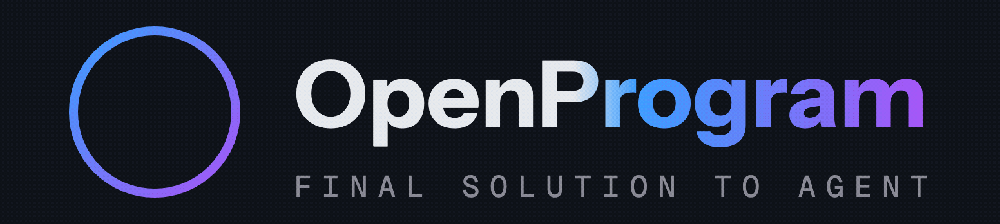
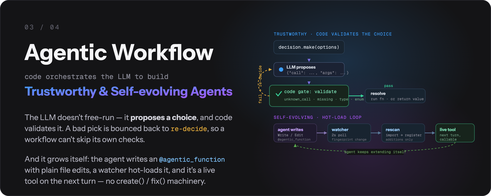

<p align="center">
  <picture>
    <source media="(prefers-color-scheme: dark)" srcset="images/logo-lockup.gif">
    <source media="(prefers-color-scheme: light)" srcset="images/logo-lockup-light.gif">
    
  </picture>
</p>

<p align="center">
  <b>OpenProgram：自编程 AI Agent 框架</b><br/>
  Agent 自动创建并持续优化自身工作流 · 任意 LLM · macOS 与 Linux release
</p>

<p align="center">
  <a href="https://arxiv.org/abs/2606.15874"></a>
  <a href="https://github.com/fzkuji-neo/OpenProgram"></a>
  <a href="https://github.com/fzkuji-neo/OpenProgram/blob/main/LICENSE"></a>
  <a href="https://www.python.org/"></a>
  
  <a href="https://github.com/fzkuji-neo/OpenProgram/actions/workflows/ci.yml"></a>
</p>

<p align="center">
  <a href="start/GETTING_STARTED.md">快速上手</a> &middot;
  <a href="install/install.zh.md">安装</a> &middot;
  <a href="reference/API.md">API 参考</a> &middot;
  <a href="capabilities/agentic-programming/philosophy.md">设计哲学</a> &middot;
  <a href="README.md">English</a>
</p>

---

> *"The more constraints one imposes, the more one frees oneself."*
> —— **Igor Stravinsky**，《Poetics of Music》

**我们提出 _Agentic Programming_。** LLM 灵活,代码确定。让模型掌控一切,得到的是混乱——不可预测的执行、上下文爆炸、没有输出保证;把一切硬编码,又丢掉了智能。**Harness** 在两者之间取得平衡,逐时逐刻地交织——**想固定的流程交给 Python,写不进脚本的判断交给 LLM。**([完整论证 →](capabilities/agentic-programming/philosophy.md))

**目录**

- [安装](#安装)
- [快速开始](#快速开始)
- [新闻](#新闻)
- [为什么是 OpenProgram？](#为什么是-openprogram)
  - [1. DAG 上下文 —— 原生多 agent 系统的地基](#1-dag-上下文--原生多-agent-系统的地基)
  - [2. Agentic 工作流 —— 可信且自我演化的 agent 的地基](#2-agentic-工作流--可信且自我演化的-agent-的地基)
  - [3. 事件基础设施 —— 主动 agent 的地基](#3-事件基础设施--主动-agent-的地基)
- [另外还带着这些](#另外还带着这些)
- [相关项目](comparisons/related-projects.md)
- [致谢](comparisons/related-projects.md#acknowledgements)
- [贡献](comparisons/related-projects.md#contributing)
- [引用](#引用)
- [许可证](#许可证)

## 安装

```bash
curl -fsSL https://openprogram.io/install | sh
```

Windows x86_64 CLI/server：

```powershell
irm https://openprogram.io/install.ps1 | iex
```

Desktop：macOS release 使用已签名并公证的 DMG；Windows 在 [GitHub Release](https://github.com/fzkuji-neo/OpenProgram/releases) 附带该产物时使用带签名的 `win-x64.exe`。Linux 与没有该 EXE 的 Windows 版本使用完整 CLI/server runtime 和 Web UI。

平台矩阵、PATH、`openprogram doctor`、source checkout 见 **[安装](install/install.zh.md)**。

## 快速开始

第一次运行 `openprogram` 进入 provider 向导，然后进终端聊天。可用 `openprogram setup` 重跑向导。

```bash
openprogram
```

打开 Web UI：http://localhost:18100

```bash
openprogram web
```

用一条打印回复确认：

```bash
openprogram --print "用一句话介绍你自己"
```

GUI Agent、Research Agent、Wiki Agent 已随每个受支持的 release 附带。第三方 Program 用 `openprogram programs install <owner>/<repo>`。详情见 [快速上手](start/GETTING_STARTED.md)。

## 新闻

- **2026-08-17** — 内置浏览器：多窗格、书签、History，以及 Agent 对可见页面的操控。
- **2026-07-21** — 多 Agent：`spawn` 子 Agent，跨会话传信，会改文件的分支跑在 git worktree 里。
- **2026-06-22** — 📄 **论文接收** —— KDD 2026 Workshop on Agentic Software Engineering（[arXiv:2606.15874](https://arxiv.org/abs/2606.15874)）。
- **2026-06-07** — 可安装 harness，以及多账户 provider 与自动 key 轮换。
- **2026-05-28** — Web UI 设计系统。
- **2026-04-04** — 内置 Anthropic / OpenAI / Gemini provider。
- **2026-04-03** — 🌱 首个版本：`@agentic_function` 与执行 DAG。

## 为什么是 OpenProgram？

OpenProgram 支持 macOS、Linux、原生 Windows x86_64 CLI/server、多 provider、完整终端 UI 和 Web 界面（Desktop App 或 `openprogram web` → http://localhost:18100）。Windows Desktop 发行路径会生成带签名的按用户 installer，并内置同一份完整 runtime；Windows 沙箱仍是单独层级。Windows release 自带 Ink TUI，只有终端无法提供 raw input 时才回退到 Python Rich 界面。移动设备可以作为浏览器客户端访问受支持的远程主机。harness 本体提供**三种构建 agent Program 的机制**。

### 1. DAG 上下文 —— 原生多 agent 系统的地基

<p align="center">
  <picture>
    <source media="(prefers-color-scheme: dark)" srcset="images/highlights/01-dag-context.png">
    <source media="(prefers-color-scheme: light)" srcset="images/highlights/01-dag-context-light.png">
    
  </picture>
</p>

每个用户轮次、LLM 调用、函数调用都是**同一张扁平 DAG 上的一个节点**。两种边赋予它含义:`caller`(谁调了谁)和 `reads`(谁的输出喂进了这次 prompt)——上下文由图组装出来,不靠手工缝合。每个 `@agentic_function` 都是**一行声明的可编程上下文**:`expose` 控制一次调用向父级展示什么,`render_range` 控制一次调用拉进多少历史(`{"callers": 0}` 给出一次性的自隔离草稿上下文,函数返回即回收——prompt 不会无界增长)。

因为上下文是**可寻址的节点而不是每个 agent 一份的缓冲区**,多 agent 不再是外挂:fork 一个分支、`spawn` 一个干净的子 agent、跨会话 `send_message`、把动文件的分支放进隔离的 `git worktree` 里跑——在同一张 DAG 上,每一样都只是"选一组不同的节点当上下文"。

### 2. Agentic 工作流 —— 可信且自我演化的 agent 的地基

<p align="center">
  <picture>
    <source media="(prefers-color-scheme: dark)" srcset="images/highlights/02-agentic-workflow.png">
    <source media="(prefers-color-scheme: light)" srcset="images/highlights/02-agentic-workflow-light.png">
    
  </picture>
</p>

**Python 驱动流程;LLM 只在被要求时推理。** 关键步骤变成**代码关卡**——模型的选择由代码解析和校验,校验不过就让它*重新决策*,而不是悄悄跳过,所以校验不可能被绕开。每次调用都是可重试、可观测的 DAG 节点。这就是执行*可信*的来源:保证写在代码里,不写在模型的善意里。

*自我演化*是一套机制,不是黑箱:agent 用**普通文件编辑工具**编写和修复自己的 `@agentic_function`,文件监听器热加载,新工具下一轮就上线——没有专门的 `create()` / `fix()` 机构。

### 3. 事件基础设施 —— 主动 agent 的地基

<p align="center">
  <picture>
    <source media="(prefers-color-scheme: dark)" srcset="images/highlights/03-event-infrastructure.png">
    <source media="(prefers-color-scheme: light)" srcset="images/highlights/03-event-infrastructure-light.png">
    
  </picture>
</p>

一条**进程级事件总线**是一切之下的基底:agent 循环、auth、上下文、渠道、记忆都往上面发事件,任何组件都能按事件类型订阅(每个事件都是统一的 `Event(type, payload, ts)` 信封,带 `id` / `origin` / `metadata`)。这里刻意只做**地基**——监视事件流并主动行动的策略层,是这条总线的第一个预期消费者。管线已经就位;主动性留给你在上面搭。

## 另外还带着这些

上面三条是纲领。下面是另外专门设计过、和常见框架不是同一套形状的东西——已经落地的打勾。

- [x] 🧠 **Scriptorium。** Markdown 在 `~/.openprogram/memory/`，每段带出处，后台攒一批再写——没有「保存这条」工具。[详情](https://github.com/Fzkuji/Scriptorium)
- [x] ♾️ **Infinite Context。** 占用率驱动 `/compact` 和自动压缩；同一轮里的工具结果也可以压，不必再发一次命令；原始记录仍留在会话里。[详情](interfaces/tui.zh.md)
- [x] 🌿 **会话存在 git 里。** 历史是仓库不是列表：侧栏可以 branch / attach / merge。[详情](start/features.zh.md#对话即-git-dag)
- [x] 🎯 **普通聊天里的 Goal。** 持久 Goal 和绑定的 todo 计划就在这场对话里，不是单独的 Goal 模式。
- [ ] 👁️ **主动策略。** 事件总线已经在跑；盯着总线自己采取行动的那一层，是下一步。
- [ ] 🖥️ **Agent terminal。** Agent 用的宿主 PTY 在做，还不是聊天里的工具。
- [ ] 🔄 **自更新。** Agent 在对话里给自己打补丁、换 runtime——带 owner 审批、验收和恢复——仍是目标。[详情](install/upgrade.zh.md#恢复对话内自更新)

## 引用

在你的工作中使用了 OpenProgram,或基于这份代码构建?请引用我们的论文——并注意在 AGPL 下,任何你**分发或作为联网服务运行**的衍生作品必须同样以 AGPL 开源,并保留署名(见[许可证](#许可证))。

> _LLM-as-Code: Agentic Programming for Agent Harness_ —— 已被 **KDD 2026 Workshop on Agentic Software Engineering (AgenticSE)** 接收。[arXiv:2606.15874](https://arxiv.org/abs/2606.15874)

```bibtex
@inproceedings{qi2026llmascode,
  title     = {LLM-as-Code: Agentic Programming for Agent Harness},
  author    = {Qi, Junjia and Fu, Zichuan and Gao, Jingtong and Zhang, Wenlin and Yan, Hanyu and Wu, Xian and Zhao, Xiangyu},
  booktitle = {KDD 2026 Workshop on Agentic Software Engineering (AgenticSE)},
  year      = {2026},
  eprint    = {2606.15874},
  archivePrefix = {arXiv},
  url       = {https://arxiv.org/abs/2606.15874},
}
```

## 许可证

[AGPL-3.0](https://github.com/fzkuji-neo/OpenProgram/blob/main/LICENSE) © 2026 Fzkuji。可自由使用、研究、修改、分享——但任何你分发**或作为联网服务运行**的衍生作品也必须以 AGPL 发布,并保留署名。
