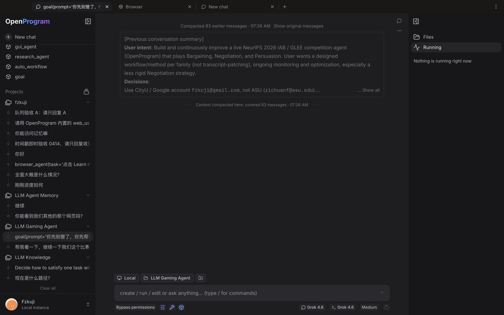

<div id="web-ui"></div>

# 网页界面

网页小窗固定使用 1920 × 1080 CSS 像素的页面视口。调整小窗大小只改变显示比例，未使用的区域留白，网页布局和 Agent 操作坐标保持不变。打开为完整标签页后恢复正常窗口尺寸和原有页面缩放。 小窗隐藏页面最外层的滚动条轨道，仍可使用滚轮和键盘滚动；打开完整标签页后恢复原有滚动条。移动小窗位置不会重新设置网页缩放。

在会话的 ⋯ 菜单中选择 **自动命名（Auto rename）**，即可让配置的默认模型根据会话内容生成名称。**重命名（Rename）** 仍可手动输入名称。生成期间显示原名称；生成失败时保留原名称并显示提示。用户明确选择的名称不会被后台自动命名覆盖。聊天区域的会话菜单也提供同一入口。该操作不会发送聊天消息或调用工具。

每个标签独立保存后退和前进历史，默认入口页是该标签的初始页面。后退和前进通常恢复当前标签中的页面，切换标签不增加历史。非会话页面可以从不同入口页分别打开。后退后选择新目的地，只替换当前标签的前进记录。历史随标签保存；网页内部的 URL 导航由浏览器控件处理。

桌面 App 的网页悬浮预览显示同一个实时页面，可以直接点击、滚动和输入。拖动标题栏移动窗口，拖动边缘调整大小；按住鼠标期间，当前画面随窗口移动或缩放；松开后恢复页面实时显示和交互。点击打开页面将同一页面显示为完整标签，隐藏预览会将页面保留在 Resources 中。普通浏览器使用独立的 sandboxed iframe 嵌入页面，网站可能禁止嵌入，且它不共享桌面 Page 的状态；需要时使用打开页面。

打开当前窗口已经显示的会话时，直接选中已有标签，从入口页或另一会话打开时也如此。目标尚未打开时，复用当前会话标签或入口页。后退和前进的目标会话若已打开，也会选中已有标签，并保留来源标签的历史。唯一性按会话 ID 判断，同名会话不会合并。重新加载旧的重复标签时，保留当前激活的一份；没有激活项则保留第一份，并保留它的历史和分组，移除其他重复标签。草稿输入和后台更新的标题在导航和重新加载后保留，已删除会话会从全部历史中移除。

在 Files 或文件标签页中，后退和前进会依次返回当前项目中浏览过的文件夹与文件。返回 Files 时恢复文件夹展开状态和滚动位置；后退后打开新位置会替换原有前进记录。文件位置属于当前标签保存的页面历史，与文档版本 History 分开。目录列表快照失效时，重新读取已加载范围期间保留已有文件行。

PDF 文件支持连续阅读、页码跳转、缩略图、文档目录、适合宽度或页面的缩放、正文选字、搜索高亮和下载原文件。复制选中文字时默认清除排版换行，保留段落分隔和正常连字符；关闭该选项可保留原换行。项目中的文件支持高亮和文字批注，并通过文档保存与 History 写入标准 PDF 批注。附件与历史版本保持只读。PDF 解码器随程序本地安装，兼容 App 内置运行时；打开 PDF 不会将文件上传至外部查看器。预览文件大小上限为 64 MiB。

项目菜单还支持在系统文件管理器中显示文件夹、创建持久 Git worktree、归档该项目聊天，以及移除侧边栏项目入口。Worktree 从当前提交创建新分支，使用源 Git 仓库外的新绝对路径；未提交改动保留在原目录。移除项目保留文件、聊天及项目归属，可在项目页面恢复或重新打开文件夹。默认主目录项目不可移除。已归档聊天可通过“已归档”筛选查看；隐藏项目的聊天仍保留在日期或平铺历史中。

右键项目或点击省略号，可以打开项目设置、新建聊天、置顶、编辑或移动到自定义分区。项目编辑窗口支持修改显示名称、文字图标或表情、说明和额外源文件夹。源文件夹用于尚未单独设置目录的会话；移除文件夹不会删除文件。主目录移动仍在项目设置中操作。分区菜单可重命名或移除分区；移除分区会保留其项目。

项目排序与聊天排序相互独立。在侧边栏筛选菜单中，可以将项目按最近活动、最早活动、名称或手动顺序排列。新消息会自动更新项目活动时间。点击项目的置顶按钮，可以让该项目保持在未置顶项目上方。聊天可按旧到新、新到旧排列，标题也支持 A–Z 和 Z–A。拖动项目会切换为手动排序。这些显示偏好保存在本地。

在侧边栏选择 **分组 → 项目** 后，可以拖动项目标题，将它移到另一项目的上方或下方；插入线显示目标位置。也可以聚焦项目标题后按 Alt+上方向键或 Alt+下方向键。顺序保存在当前设备，刷新后仍然保留；会话的项目归属不变。正在运行的会话只在当前选中行保留彩色扫光；其他正在运行、但未选中的会话只显示标题左侧的三个闪动点。等待你输入的会话显示黄色圆点，置顶会话也遵循这一规则。

工具审批行为及运行中切换请参见[工具权限模式](../capabilities/permissions.zh.md)。

浏览器界面，覆盖 OpenProgram 的全部日常操作：聊天、管理函数与程序、配置 provider 和 MCP、查看记忆与项目。本页按路由逐个说明每个页面的用途，并详细介绍聊天页。

启动：

```bash
openprogram web
```

浏览器打开 `http://localhost:18100`。页面是由本地 FastAPI worker 直接提供的静态导出——`/api`、`/ws` 和 UI 都在同一个端口（默认 18100）。数据全部来自 worker，会话与终端 TUI、CLI 单发共用，见[界面总览](README.zh.md)。改端口用 `openprogram ports --port`。



### 文件操作

复制和剪切会记录来源项目，只能在来源项目内粘贴。切回来源项目后可继续粘贴。刷新文件列表会重新执行当前文件搜索。

删除文件或文件夹会将其移入 OpenProgram 的可恢复存储。运行 `openprogram trash list` 查找记录，再运行 `openprogram trash restore <entry_id>` 恢复。恢复操作不会覆盖已存在的路径。删除或重命名符号链接只操作链接本身，不操作它指向的目标。

文本文件存在未保存修改时，删除前会询问保存、导出或丢弃。导出会启动浏览器下载，并继续保留本地草稿，因为浏览器不会确认下载完成。恢复文件后重新打开，可恢复保留的草稿。


## 聊天页（/chat、/s/&lt;session-id&gt;）

`/chat` 是聊天主界面；`/s/<session-id>` 是单个会话的直达链接，切换会话不重新加载页面，WebSocket 连接保持不断。

### 消息流式

消息写入连接后，文字立即显示在对话中，本次提交的输入框文字随即清空。服务端确认接收前，消息保留待确认状态；确认后更新同一条消息。随后显示回复占位，text、thinking、工具调用等块通过 WebSocket 按到达顺序增量渲染。多个 agent 写入同一会话时，每条回复消息都带有产出它的 agent 的头像和名字。

### 运行期间发送消息

**Queue** 按顺序保存消息，前一轮完成后再开始下一轮。**Steer** 和队列消息的“追加到当前轮”在正在运行的 Agent 到达下一个安全点时补充指令，不取消正在执行的工具，也不修改其模型、工具或权限设置。停止执行仍是输入框中的独立操作。

无法追加到当前轮时，消息保留在队列。如果无法确认投递结果，消息行继续显示，重试使用同一条命令以避免重复投递，不会自动作为新一轮再次发送。补充指令最多支持 4,096 个字符，更长的消息保留排队。未发送队列存放在当前窗口内存中，重新加载页面会丢失。带附件的消息也可以排队，等待正常轮次发送，不能通过纯文字补充接口注入。排队消息集中显示在输入框上方，保留紧凑气泡，并可收起为数量。点击附件卡片即可预览。编辑排队消息时可以修改文字、添加文件和移除附件；保存保留原队列位置，取消保留原内容。编辑期间暂停该条消息发送。移除只撤回选中的排队消息。正在投递或等待确认的消息不可编辑或移除。本地文档附件使用与项目文件相同的只读预览。

### 停止与重新连接

点击输入框中的 **Cancel execution** 停止当前执行。刷新或重新打开会话时，会恢复正在执行的任务及其停止控制，包括审批等待后恢复的执行。没有新输出不代表执行已经结束；系统不会仅因一段时间没有输出就移除运行状态。已经结束的执行不会因为残留的线程注册继续显示为运行中。

回复生成期间，思考、已有正文和工具步骤会持续保存，刷新后可以恢复。回复失败时，已有过程与错误提示同时保留；手动停止也会保留已经收到的过程。

本地 shell 命令会先结束其进程组，再报告取消。恢复执行的会话会将原助手消息持久化为已取消，并将会话恢复为空闲，刷新后仍保持停止状态。

### thinking 折叠

模型的思考过程渲染为可折叠块，默认收起，流式期间只显示最新一行，点击展开完整内容。

### 函数调用时间线

每轮回复中的函数 / 工具调用渲染成一条可展开的执行时间线：每步一行，函数调用带参数、输出、错误和耗时，嵌套调用按上下文树递归展示，子 agent 也是时间线中的一步。点击某一步会在右侧栏打开执行详情面板。从 `/programs` 页 Run 对话框手动运行的函数也用同一套时间线渲染。回复完成后保留流式时间线；缺少有序内容块的旧记录也使用相同折叠组件，不再显示独立的工具调用表格。

### 附件

可以粘贴截图、拖入文件，也可以通过输入框菜单选择文件。图片和文件按添加顺序紧凑排列，每项显示名称、格式和大小。点击附件查看预览或详情，点击 × 移除。

图片直接提供给支持看图的模型，同时在聊天中保存原图副本。应用接受最多 32 MiB 的原图，发送版本过大时等比缩小到不超过 5 MiB。所选模型不支持看图时会明确报错，不会悄悄忽略图片。

桌面 App 中的文本、代码、数据、PDF 和 Office 文件引用原路径，由助手根据任务调用工具读取，不自动把文件正文加入提示词。拖入文件夹时只提供第一层目录，最多 200 项或 8 KiB，不扫描子文件夹。浏览器选入且没有原路径的文件由后端保存，再引用保存位置。

读取完成的草稿附件随所属聊天保留，刷新后可以恢复。发送后只在后端确认接收时清除本次提交的项目。读取失败或发送被拒绝时，文字和附件继续保留。如果连接在确认前断开，应用不会自动重新发送。

### 无头或远程 Linux 上的项目目录

Project 文件夹和额外工作目录都指向运行 worker 的机器上的路径。通常
OpenProgram 会打开这台机器的原生文件夹选择器；如果 Linux 没有 X11 或
Wayland display（例如通过 SSH 使用服务器），Web UI 会改为显示服务器路径
输入框。填写 `/srv/projects/example` 这样的绝对路径后，worker 会先确认目录
存在再使用。原生选择器可用时，用户点取消仍然只是取消，不会误弹手工输入框。

### 会话分支与 DAG 视图

会话历史按 DAG 存储，不是扁平列表：

- 顶栏的分支菜单列出当前会话的所有分支，可切换（checkout）、重命名、删除。
- 右侧栏的 History 视图是会话的实时 mini-DAG：每条消息或函数调用一个节点，按分支着色，merge 和 attach 操作也以节点形式出现。单击节点折叠 / 展开其子树（或把聊天滚动到该步），双击节点或边即切换（checkout）到那条分支。
- mini-DAG 上方的 Branches 面板列出各分支，运行中的分支带运行标记；支持多选合并——平等合并出新分支尖端，或就地合并进选定的基准分支——也支持把另一个会话的分支挂接进来（跨会话 attach）。
- 同一条消息的多个版本用 `< N/M >` 切换器切换，只移动显示位置，不删除历史。

### 回滚

每条消息的操作菜单里有 "Rewind to here"：把会话真正回退到该消息处，被撤销的用户输入会预填回输入框，可修改后重发。输入框斜杠命令 `/rewind` 是同一功能。

## 其他页面

| 路由 | 用途 |
|---|---|
| `/chats` | History 枢纽：会话列表（`/history` 同页）；Projects 和 Memory 是同一页上的 tab |
| `/programs` | Abilities 枢纽：Programs 目录（调用树 / 图）。Plugins、Skills、MCP 是旁边的 tab |
| `/skills` | Abilities → Skills：浏览已装 SKILL.md、发现和新建；每个 skill 有详情页 |
| `/plugins` | Abilities → Plugins：已安装 / 市场 / 错误 |
| `/mcp` | Abilities → MCP：从目录添加、编辑配置、查看状态 |
| `/memory` | History → Memory：wiki、journal 和核心记忆 |
| `/projects` | History → Projects：权限规则、默认设置、关联会话 |
| `/settings` | 设置：providers（模型与凭据）、search、general（含主题、运行版本，以及存在 Electron bridge 时的 Desktop 更新状态）、system、usage、auth、channels |

`/settings` 直接打开会跳到 `/settings/general`。模型凭据仍在 `/settings/providers`，见[配置模型](../models/README.zh.md)。

### 会话运行记录

“运行记录”合并原来的 Running 和 Debugger。只有当前标签、可见页面路径和聊天状态指向同一会话时，才显示该会话的记录；新标签页、尚未发送的草稿及非会话页面显示空提示，不残留上一个会话的数据。从 Abilities 打开 Program 会进入草稿标签，仅打开参数表单不会产生执行历史。Activity 按会话分支计数，不按消息或执行次数计数。同一分支连续发送消息始终保留一个条目；真正分叉后才分别显示。选择分支可查看各轮执行、调用的子 Agent 及托管后台程序。程序列在启动它的执行下。子 Agent 可以使用独立执行会话；列表只纳入明确关联的执行及其后代，不会混入目标会话的其他任务。

“需要处理”显示暂停任务和待确认结果。“正在进行”显示运行任务，以及仍有程序运行的已结束 Agent。“历史记录”默认折叠，按已结束的会话分支计数。点击分支可查看各轮执行，再查看所属子 Agent、程序和执行详情。分支行显示分支名或编号及请求摘要，执行时间保留在详情中；较长的请求摘要可在详情中展开。程序名称显示可识别的脚本文件、Python 模块或包脚本，并保留所属执行内的编号。内联代码标记为代码片段；无法可靠识别的命令保留可执行文件名。程序详情始终保留完整原始命令。Agent 结束不会删除所属程序。刷新页面或重启本地 worker 后，托管程序的记录和输出仍保留。历史上从未记录的程序无法追溯恢复或推测归属。 已结束且仅缺失模型响应回执的执行归入历史，标注“已结束 · 响应记录不完整”，不要求用户确认；执行者已结束但取消命令仍未完成时也适用。若没有活动子执行，这类历史记录不再显示取消按钮。真实问题、审批、结果未知的工具操作和活动子任务仍然保留。

选择 Agent 后查看进展并使用已有执行控制。暂停、继续、单步和重试仅在执行确实支持时提供。“补充指令”和“创建分支”使用统一编辑弹窗。已发布指令保持只读；“编辑为新草稿”创建需要独立校验的修订，不改写已发布版本。需要回答的问题和授权请求优先于进展记录显示。内部 ID、修订信息、资源快照、操作计数、保存点和原始事件放在“技术详情”中。结果待确认表示执行受阻，不是持续生成。没有活动 attempt 时，输入框允许发送新消息，刷新后不会恢复取消按钮；活动面板继续保留待确认结果及其操作限制。快照读取成功也不代表 Agent 正在运行。

History 的数量表示已结束的会话分支数。分支状态随最新执行更新，真实等待和仍在运行的程序仍会显示；旧轮次只保留在分支详情中，不增加 History 数量。暂时无法确认所属分支的记录单独显示，不计入分支数量。

选择程序后查看命令、工作目录、运行环境、开始与结束时间、退出码和输出。“停止程序”只控制该程序的受管进程组，包括普通后台子进程，不影响其他程序。输出有容量限制；发生截断时明确提示，程序记录仍然保留。Activity 根据执行和 Job 事件自动更新，打开面板、恢复连接或页面恢复可见时也会自动读取，没有手动刷新按钮。执行快照每 30 秒补充检查一次；托管程序尚无专用事件流，因此页面可见时每 3 秒检查程序状态和输出。首次读取失败显示加载错误，不声称已有旧记录。未关联 Agent 的程序仍然显示，且不会同时提示没有运行记录。读取失败时保留上次记录、所选程序详情和输出，并提示状态可能过时。切换所选程序时清空旧详情；成功刷新的列表已不包含该程序时也会清空。

长时间运行的程序通过 `process` 工具的 `start` 操作启动，归属来自可信执行与会话上下文。独立监督进程在 worker 重启后继续保留输出和控制；普通 shell 后台子进程仍属该进程组。刻意脱离进程组的程序，或未通过框架进程管理启动的程序，不宣称已被监控。

从保存点创建 Agent 分支时，在“按新指令创建分支”输入指令，然后准备、检查、确认并发布修订。创建分支后选中独立的暂停子执行，点击继续后使用已发布指令。原执行的消息和保存点不变。修改未发布指令会生成新草稿版本，旧校验和审批失效。仅补充指令的修订保留程序与运行契约；修改程序、工具、模型或输出契约仍要求独立审批。

重试在保存点创建独立、暂停的 Agent 执行并保留原修订，点击继续后恢复。

## 管理项目文件

Files 顶部依次为路径行、操作行和按需展开的搜索行。点击路径分段可以在项目树中定位对应目录。操作行提供搜索、新建文件、新建文件夹、刷新、排序与显示、查看详细信息。每个目录可以按名称、修改时间、大小或类型排列，选择升降序、文件夹优先，以及是否显示隐藏项和 Git 忽略项。设置按项目保存在本地，侧边栏和中央 Files 共用。搜索仍按相关度排列。

工具栏和文件右键菜单均可打开详细信息，查看路径、文件字节数、时间和只读权限。可见文件夹通过有限队列统计大小。目录行显示完整统计或缓存估值，`≥` 表示部分结果；详情提供统计时间、跳过条目数以及继续、取消、重新计算。统计累计文件逻辑字节数，包含隐藏文件，跳过符号链接、受限目录和不可读条目。结果是在一段时间内取得的样本，不是原子快照或磁盘分配量，缓存可能过期。近期完整统计参与大小排序；计算完成后刷新可以重新排列，未知大小和部分统计排在同组末尾。

路径使用较大字号，最右侧按钮复制完整绝对路径。刷新保留选中路径、展开目录和已加载分页范围。普通文件行显示可读大小（包括空文件），悬停大小可查看准确字节数。

侧边栏只显示有未归档对话的项目。空项目仍可在项目选择器和项目管理界面找到。

对话历史存放在 OpenProgram 状态目录中，按稳定的项目 ID 分组，不写进工作文件夹。文件夹被重命名或磁盘重新挂上时，若平台能核对原生目录身份，就会更新位置。复制品、以及占用原路径的另一个文件夹，都不会自动继承原来的对话。工作文件夹缺失时仍可阅读历史，并保留“定位文件夹”；该项目的新任务要等到目录再次有效才会启动。

按下顶部标签只高亮，未拖动时松开才切换页面；拖动期间保留当前页面。拖出标签栏后松开可使用现有新窗口分离功能，“新窗口”提示显示在标签栏内，避免被原生网页遮挡。要把已打开的网页加入会话，先保持该会话显示，再把网页标签拖到 **Resources** 入口或其展开内容区，松开即绑定原页面。顶部标签和原有关联保留，绑定失败不会改变页面。
