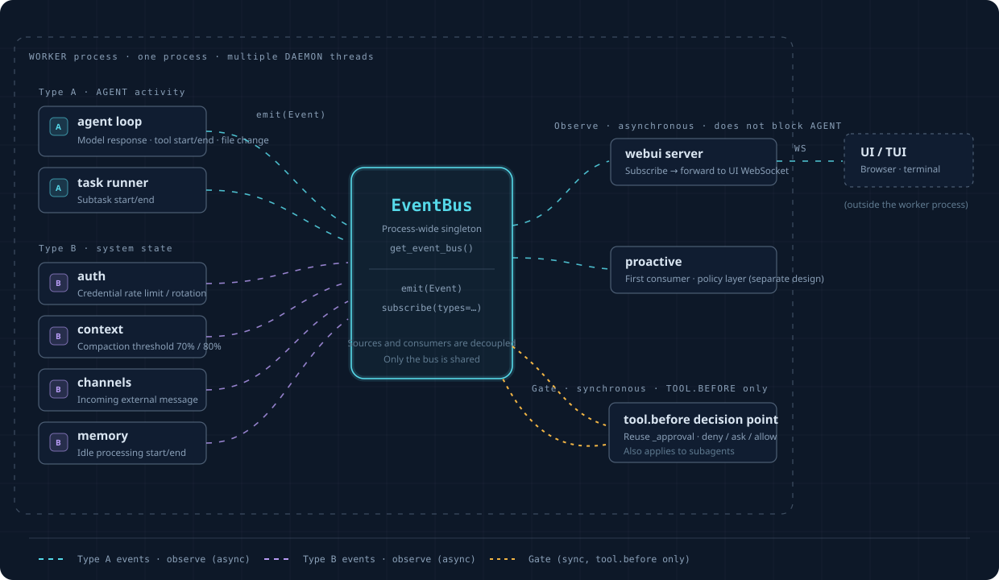

# Event Layer

A single unified event stream for the whole framework. proactive is just its first consumer.

**Why**: without this layer, the "something happened" signal in the framework is scattered across six unconnected mechanisms (the agent loop's
AgentEvent stream, auth's `_emit`, context's on_event, the channels WS broadcast, memory's periodic poll, and the
store's plain logging). To "do something at a certain moment", you first have to figure out which mechanism owns that moment and how to hook into it. This layer unifies them into
**a single bus: sources emit into it, consumers subscribe from it**.

The layer has ten parts. Where each one lives:

| # | Part | Where |
|---|---|---|
| 1 | Central registry (`EVENTS`) | `openprogram/events/registry.py` |
| 2 | Event object | `openprogram/events/bus.py` (`Event`, `make_event`) |
| 3 | Typed dispatch: notify + gate | `EventBus.emit` / `EventBus.emit_gate` |
| 4 | Subscription management | `EventBus.subscribe` / `EventBus.subscribe_gate` |
| 5 | Error semantics | isolation for notify, fail-open for gates (§4) |
| 6 | Veto protocol | Python return value / shell exit codes (§5) |
| 7 | Event log | `openprogram/events/event_log.py` — per-session `events.jsonl` with rotation (§6) |
| 8 | Threading model | gates run synchronously in the emitter's thread (§4) |
| 9 | Observability | gate verdicts recorded on the event's log line (§6) |
| 10 | Admission boundary | the registry itself; `registry.py` module docstring |

Everything event-related lives in the `openprogram/events/` package, and every import goes through it
(`from openprogram.events import ...`).

## 1. The Event Model

The three core fields (what happened + content + time) are fixed; correlation info goes into an open metadata pocket rather than hard-coded fields.

```python
@dataclass(frozen=True)
class Event:
    id: str          # unique id
    ts: float        # when it happened
    type: str        # what kind of event, see §2
    origin: str      # who triggered it: user / agent / tool / system / proactive
    payload: dict    # the event's content (command, file path, which account got rate-limited, ...)
    metadata: dict   # open pocket: {"session":..., "turn":..., "lane":...}, fill in only when needed
```

Why session/turn go into the pocket rather than being fixed fields: they are not intrinsic properties of an event, they are
externally attached correlations, and for half the events (auth, channel) they have no meaning at all. An open dict also lets new
correlation dimensions in later without changing the model.

`make_event` auto-fills id/ts and the session/turn correlation from the store ContextVars when inside a
dispatcher-driven turn; explicit `metadata` keys win over the auto ones.

## 2. The Registry — the Admission Boundary

`openprogram/events/registry.py` holds `EVENTS = {name: EventSpec(kind, payload_doc)}`. **An event type
enters the registry only when a real consumer subscribes to it** — a moment becomes an event because someone
wants to respond to it, never because the code happens to pass through it. This is the same principle
`events/bridges.py` applies to type-B sources, and it is what keeps the stream from rotting into a dumping ground.

The registered events:

| type | kind | payload | emitted from |
|---|---|---|---|
| `tool.before` | gate | `{tool, tool_call_id, args}` | `agent_loop._execute_tool_calls`, before every `tool.execute()` |
| `tool.after` | notify | `{tool, tool_call_id, is_error, result_text}` | `agent_loop._execute_tool_calls`, after every tool call finishes |
| `turn.stop` | gate | `{session_id, user_msg_id, assistant_msg_id, last_text (≤4000 chars), stop_hook_active}` | `dispatcher.process_user_turn`, after a completed top-level chat turn |
| `turn.start` | notify | `{session_id, user_msg_id, assistant_msg_id}` | dispatcher, after the user message is persisted |
| `turn.end` | notify | `{session_id, user_msg_id, assistant_msg_id, usage}` | dispatcher, after finalize |
| `session.start` | notify | `{session_id, agent_id, channel}` | webui session creation (`server.py`) |
| `chat.before_send` | notify | `{session_id, msg_id, text, agent_id, attachments}` | `ws_actions/chat.py`, after the user message is persisted, before it enters the runtime |
| `plugin.enable` | notify | `{plugin}` | `plugins/loader.py`, after the plugin loaded and its hook subscriptions registered |
| `plugin.disable` | notify | `{plugin}` | `plugins/loader.py`, before the plugin's registrations are dropped |
| `goal.update` | notify | `{session_id, goal: {text, status, turns_used, max_turns, last_reason, last_question}}` | `goal._emit_goal_update` |
| `user.prompt_submitted` | notify | `{msg_id, chars}` | `dispatcher/prep.py`, after the user row persists |
| `model.response_started` / `model.response_completed` | notify | `{}` / `{is_error}` | `agent_loop`, per model response within the loop |
| `file.changed` | notify | `{path, op}` | the write / edit / apply_patch tools |
| `question.asked` | notify | `{session_id, question, ...}` | `agent/questions.py` |
| `context.compacted` | notify | `{ok, tokens_before, tokens_after, ...}` | `context/engine.py` |
| `memory.ingest_started` / `memory.ingest_ended` | notify | `{messages}` / `{ok, retryable, reason}` | `memory/session_watcher.py` |
| `channel.message_inbound` | notify | `{channel, peer_kind, chars}` | `channels/_conversation.py` |
| `branches.listed` / `sessions.listed` | notify | `{session, count}` / `{count}` | the agent-collab list tools |
| `skills.changed` | notify | `{}` | the skills watcher (`server.py`) |
| `plugins.update_available` | notify | `{plugin, current, latest}` | the plugin update checker (`server.py`) |

Every `emit_safe` type string in the codebase is registered — a test enforces the subset
(`test_every_emitted_type_is_registered`). Emitting an unregistered type logs one warning per type
(never raises), which catches new emit sites that skip the registry.

## 3. Two Dispatch Modes

**Notify (default, asynchronous)**: `emit(event)` fans out to `subscribe(handler, types={...})` subscribers,
fire-and-forget. The emitter never waits; a slow or broken subscriber cannot slow the framework down.

**Gate (synchronous veto)**: `emit_gate(event, timeout_s=None) -> GateOutcome{allowed, reasons}` calls every
`subscribe_gate(type, fn)` subscriber for that type, in registration order, in the emitter's thread. Any
returned reason makes `allowed=False`; reasons aggregate. `subscribe_gate` returns an unregister function,
like `subscribe`.

Gate rules:

- **Fast only.** A gate sits in the middle of the action's path — no LLM calls, no slow IO.
- **Re-entrancy guard**: a nested `emit_gate` for the same type in the same thread allows immediately with a
  warning, so a gate can never gate itself into a loop.
- `timeout_s` is a soft overall budget: once exceeded, the remaining gates are skipped fail-open with a warning.
- Both classes apply to subagents: `tool.before` sits outside the permission_mode approval wrapper, so
  `permission_mode="bypass"` cannot turn it off.

## 4. Error Semantics and Threading

- A raising **notify** subscriber is isolated: logged, other subscribers still run, the emitter never sees it.
- A raising **gate** subscriber is **fail-open**: logged to stderr, treated as allow — one gate's bug must not
  brick every tool call.
- **Shell** subscribers always run under a timeout (default 60 s, configurable per hook); a timeout is fail-open
  with a warning.
- Gates run synchronously in the calling thread; notify handlers run in the emitter's thread too (async
  handlers are scheduled on the running loop when one exists).

## 5. The Veto Protocol

**Python gate functions** (the ToolGate signature): return `None` to allow, a reason string to deny. The merged
deny reason reaches the actor — for `tool.before` it becomes the model's error tool result via
`ToolGateDenied`; for `turn.stop` it becomes the continuation prompt prefixed with `[hook]`.

**Shell subscribers** follow the Claude Code hooks exit-code protocol. The Event arrives as JSON on stdin.

| exit code | meaning |
|---|---|
| 0 | allow |
| 2 | deny; stderr is the reason |
| anything else | fail-open, logged as a warning |

Shell subscribers come from the top-level `hooks` key in config.json
(registered as the `hooks` setting in `config_schema.py`):

```json
{
  "hooks": {
    "turn.stop": [{"command": "python check_done.py", "timeout": 30}],
    "turn.end":  [{"command": "notify-send 'turn finished'"}]
  }
}
```

At worker start, `openprogram.events.install_config_hooks()` (`shell_hooks.py`) registers each command: gate-kind events get a synchronous
shell gate, notify-kind events get a background runner (daemon thread, exit code ignored, failures logged).
Config edits apply on the next worker restart.

### The `turn.stop` continuation loop

`dispatcher/stop_hook.continue_stop_hook_turns` asks the `turn.stop` gate after every completed top-level
chat turn. Goal Workflow rounds do not enter this dispatcher path: the single `goal()` function owns their
completion judge, and `/goal clear` can stop the Goal state. A denial launches one more ordinary turn with
`dataclasses.replace`, `source="hook_continue"`, and `INHERIT_PARENT`, then the gate runs again on
the new result. Runaway protection is the `stop_hook_active` flag protocol (as in Claude Code / Codex stop
hooks — no numeric cap): `payload["stop_hook_active"]` is True on every ask after the first, so a hook knows
it already forced a continuation and is expected to allow the stop. Failed or cancelled turns return without
asking the gate. Head movement stays with the normal TurnWriter path inside each turn.

## 6. The Event Log

The process-wide bus appends every completed typed dispatch as one JSON line, always on:

- `~/.openprogram/sessions/<sid>/events.jsonl` when the event carries a session whose directory exists;
- `~/.openprogram/logs/events.jsonl` otherwise.

A file past 5 MB rotates to `.1` (replacing the previous `.1`). Gate verdicts are recorded on the same line as
a `gate` field — `{allowed, reasons, duration_ms, subscribers}` — not emitted as a second event. This is the
layer's observability: read the log after a real turn to see the full stream and every gate decision.

When a registered gate event first passes through `emit(event)` for typed observers, that notify phase defers
the disk write. The same Event must then reach `emit_gate(event)`, which writes the single verdict-enriched row.
Calling `emit` alone for a gate type is an incomplete dispatch: observers still receive it, but no event-log row
is written before the verdict exists. `emit_gate(event)` is also a complete gate-only dispatch—the current
`turn.stop` path uses it directly—so it writes one verdict row without invoking typed observers. Notify-kind
events continue to log during `emit`.

## 7. Placement: a Process-Level Singleton Bus

All the relevant components (webui, agent loop, channels, memory, auth, task runner) run in **the same worker
process** (each as a daemon thread). So the bus is a **process-level singleton** in `openprogram/events/bus.py`, with
a `get_event_bus()` accessor following the same double-checked-locking pattern as `get_store()`/`get_runner()`.
Only the singleton writes the event log; isolated buses from `create_event_bus()` (tests, embedded use) stay
silent.

Dependency direction: the event system imports nothing from webui. webui subscribes to the bus (the
`ws.frame` pass-through envelope); the bus does not know webui exists.

## 8. Architecture Diagram



> Interactive version (full visualization page with animated event flow): [`event-layer.html`](event-layer.html)

- The bus is the sole hub: sources and consumers don't know each other, they only know the bus.
- webui and proactive are both just **consumers**, at the same level. proactive is an application on top of
  the layer, not part of it.
- Gate dispatch is the single synchronous line; everything else is asynchronous observation.

## 9. Wiring Summary

| consumer-facing surface | backed by |
|---|---|
| `tool_gate.register_tool_gate` / `decide_tool_gate` / `ToolGateDenied` | thin shell over `subscribe_gate("tool.before", ...)` / `emit_gate` — public signatures unchanged for agent_loop and the proactive engine |
| plugin `hooks` entrypoint | `plugins/hooks.register_plugin_hooks` subscribes each handler on the bus, keyed by bus event name — notify events via `subscribe`, gate events (`tool.before` and `turn.stop`) via `subscribe_gate` with the veto protocol (falsy return allows, a reason string or `ToolGateDenied` denies, any other exception is logged and fail-open) |
| `/goal` state changes | `goal._emit_goal_update` also emits `goal.update` |
| config.json `hooks` | `openprogram.events.install_config_hooks()` at worker start |
| type-B sources (auth, context, channels, memory) | `openprogram/events/bridges.py` bridge + per-source `emit_safe` taps |
