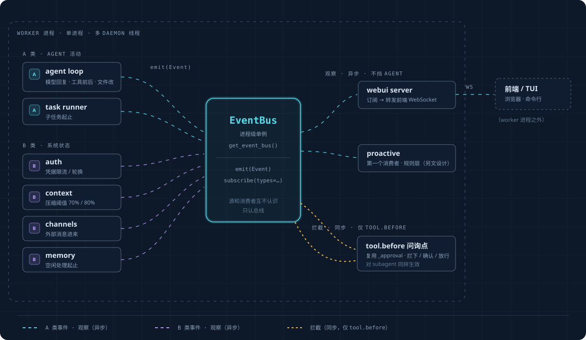

# 事件层

全框架唯一的统一事件流。proactive 只是它的第一个消费者。

**为什么**：没有这一层时，框架里"发生了什么"的信号散在六套互不相通的机制里（agent loop 的
AgentEvent 流、auth 的 `_emit`、context 的 on_event、channels 的 WS 广播、memory 的周期轮询、
store 的普通日志）。想"在某个时机做点什么"，得先弄清那个时机归哪套机制管、怎么挂进去。这一层把
它们统一成**一条总线：源往里 emit，消费者从里 subscribe**。

事件层共十个部件，各自的落位：

| # | 部件 | 位置 |
|---|---|---|
| 1 | 集中注册表（`EVENTS`） | `openprogram/events/registry.py` |
| 2 | Event 对象 | `openprogram/events/bus.py`（`Event`、`make_event`） |
| 3 | 类型化派发：notify + gate | `EventBus.emit` / `EventBus.emit_gate` |
| 4 | 订阅管理 | `EventBus.subscribe` / `EventBus.subscribe_gate` |
| 5 | 错误语义 | notify 隔离、gate fail-open（§4） |
| 6 | 否决协议 | Python 返回值 / shell 退出码（§5） |
| 7 | 事件日志 | `openprogram/events/event_log.py`——每会话 `events.jsonl`，自动轮转（§6） |
| 8 | 线程模型 | 闸门在发射方线程同步执行（§4） |
| 9 | 可观测性 | gate 结论记在事件日志行上（§6） |
| 10 | 准入边界 | 注册表本身；`registry.py` 模块 docstring |

事件相关的一切都收在 `openprogram/events/` 包里，所有 import 一律走
`from openprogram.events import ...`。

## 1. Event 模型

三个核心字段（发生了什么 + 内容 + 时间）固定；关联信息进开放的 metadata 口袋，不做硬编码字段。

```python
@dataclass(frozen=True)
class Event:
    id: str          # 唯一 id
    ts: float        # 发生时间
    type: str        # 哪类事件，见 §2
    origin: str      # 谁触发的：user / agent / tool / system / proactive
    payload: dict    # 事件内容（命令、文件路径、哪个账号被限流……）
    metadata: dict   # 开放口袋：{"session":..., "turn":...}，需要才填
```

session/turn 进口袋而非固定字段：它们不是事件的固有属性，是外挂的关联，且对一半事件（auth、
channel）根本没有意义。开放 dict 也让以后新增关联维度不用改模型。

`make_event` 自动补 id/ts，并在 dispatcher 驱动的轮内从 store ContextVar 取 session/turn 关联；
显式传入的 `metadata` 键覆盖自动值。

## 2. 注册表——准入边界

`openprogram/events/registry.py` 里 `EVENTS = {name: EventSpec(kind, payload_doc)}`。**一个事件
类型进注册表，唯一的理由是有真实消费者要响应它**——不是因为代码恰好路过那里。这与 `bridges.py`
对 B 类源的原则同源，也是事件流不腐化成垃圾场的关键。

已登记的事件：

| type | kind | payload | 发射点 |
|---|---|---|---|
| `tool.before` | gate | `{tool, tool_call_id, args}` | `agent_loop._execute_tool_calls`，每次 `tool.execute()` 之前 |
| `tool.after` | notify | `{tool, tool_call_id, is_error, result_text}` | `agent_loop._execute_tool_calls`，每次工具调用结束之后 |
| `turn.stop` | gate | `{session_id, user_msg_id, assistant_msg_id, last_text（≤4000 字）, stop_hook_active}` | `dispatcher.process_user_turn`，仅无会话目标的会话 |
| `turn.start` | notify | `{session_id, user_msg_id, assistant_msg_id}` | dispatcher，用户消息落盘之后 |
| `turn.end` | notify | `{session_id, user_msg_id, assistant_msg_id, usage}` | dispatcher，finalize 之后 |
| `session.start` | notify | `{session_id, agent_id, channel}` | webui 会话创建（`server.py`） |
| `chat.before_send` | notify | `{session_id, msg_id, text, agent_id, attachments}` | `ws_actions/chat.py`，用户消息落盘之后、进入 runtime 之前 |
| `plugin.enable` | notify | `{plugin}` | `plugins/loader.py`，插件加载完成、hook 订阅注册之后 |
| `plugin.disable` | notify | `{plugin}` | `plugins/loader.py`，插件的注册项被摘除之前 |
| `goal.update` | notify | `{session_id, goal: {text, status, turns_used, max_turns, last_reason, last_question}}` | `goal._emit_goal_update` |
| `user.prompt_submitted` | notify | `{msg_id, chars}` | `dispatcher/prep.py`，用户行落盘后 |
| `model.response_started` / `model.response_completed` | notify | `{}` / `{is_error}` | `agent_loop`，循环内每次模型响应 |
| `file.changed` | notify | `{path, op}` | write / edit / apply_patch 工具 |
| `question.asked` | notify | `{session_id, question, ...}` | `agent/questions.py` |
| `context.compacted` | notify | `{ok, tokens_before, tokens_after, ...}` | `context/engine.py` |
| `memory.ingest_started` / `memory.ingest_ended` | notify | `{messages}` / `{ok, retryable, reason}` | `memory/session_watcher.py` |
| `channel.message_inbound` | notify | `{channel, peer_kind, chars}` | `channels/_conversation.py` |
| `branches.listed` / `sessions.listed` | notify | `{session, count}` / `{count}` | agent-collab 的列表工具 |
| `skills.changed` | notify | `{}` | skills watcher（`server.py`） |
| `plugins.update_available` | notify | `{plugin, current, latest}` | 插件更新检查（`server.py`） |

代码里每个 `emit_safe` 的 type 字符串都已入册——有测试强制这个子集关系
（`test_every_emitted_type_is_registered`）。emit 未注册的 type 每个只 log.warning
一次（不抛），用来暴露绕过注册表的新发射点。

## 3. 两种派发

**notify（默认，异步）**：`emit(event)` 扇出给 `subscribe(handler, types={...})` 的订阅者，发完
即走。发射方永不等待；订阅者再慢再坏也拖不慢框架。

**gate（同步否决）**：`emit_gate(event, timeout_s=None) -> GateOutcome{allowed, reasons}` 在发射
方线程里按注册序逐个调用该 type 的 `subscribe_gate(type, fn)` 订阅者。任一返回理由即
`allowed=False`，理由聚合。`subscribe_gate` 与 `subscribe` 一样返回注销函数。

闸门规则：

- **必须快。** 闸门挡在动作的路中间——不许调 LLM、不许慢 IO。
- **防重入**：同线程内嵌套 `emit_gate` 同一 type 直接放行并 warning，闸门不可能把自己闸成死循环。
- `timeout_s` 是软性总预算：超出后剩余闸门跳过（fail-open）并 warning。
- 对 subagent 同样生效：`tool.before` 位于 permission_mode 审批包装之外，
  `permission_mode="bypass"` 关不掉它。

## 4. 错误语义与线程模型

- **notify** 订阅者抛异常：隔离——记日志、其余订阅者照跑、发射方无感。
- **gate** 订阅者抛异常：**fail-open**——写 stderr、按放行处理。一个闸门的 bug 不能砖掉所有工具调用。
- **shell** 订阅者必有超时（默认 60 秒，逐条可配）；超时按 fail-open 记 warning。
- 闸门在调用方线程同步执行；notify 处理器也在发射方线程调用（async 处理器有运行中的 loop 时调度上去）。

## 5. 否决协议

**Python 闸门函数**（ToolGate 签名）：返回 `None` 放行、理由字符串否决。合并后的理由回到动作方——
`tool.before` 经 `ToolGateDenied` 变成模型收到的 error tool result；`turn.stop` 变成
`[hook] <理由>。继续。` 的续轮提示词。

**shell 订阅者**沿用 Claude Code hooks 的退出码协议。Event 以 JSON 形式从 stdin 进来。

| 退出码 | 含义 |
|---|---|
| 0 | 放行 |
| 2 | 否决；stderr 即理由 |
| 其他 | fail-open，记 warning |

shell 订阅者来自 config.json 顶层 `hooks` 键（`config_schema.py` 登记为 `hooks` 设置项）：

```json
{
  "hooks": {
    "turn.stop": [{"command": "python check_done.py", "timeout": 30}],
    "turn.end":  [{"command": "notify-send 'turn finished'"}]
  }
}
```

worker 启动时 `openprogram.events.install_config_hooks()`（`shell_hooks.py`）逐条注册：gate 型
事件挂同步 shell 闸门，notify 型事件挂后台执行器（daemon 线程、忽略退出码、失败只记日志）。改
配置重启 worker 生效。

### `turn.stop` 续轮循环

`dispatcher/stop_hook.continue_stop_hook_turns` 只在**没有会话目标**的会话上、每个完成的轮之后问
`turn.stop` 闸门。分工：有 goal 的会话只有一个停止决策者——它自己的 goal 循环，外部干预只有
`/goal clear`；`turn.stop` 闸门是无 goal 会话的扩展点。被否决则再跑一轮——构造方式与 goal 续轮
同款（`dataclasses.replace`、`source="hook_continue"`、`INHERIT_PARENT`），跑完对新结果再问闸门。
防失控是 `stop_hook_active` 标志协议（同 Claude Code / Codex 的 stop hook——没有数字上限）：首问
之后每次 `payload["stop_hook_active"]` 为 True，hook 由此知道自己已经强制续过轮，应当放行。轮
失败/被取消不再问闸门直接返回。head 移动始终走每轮内部正常的 TurnWriter 路径。

## 6. 事件日志

进程级总线把每个完成派发的类型化事件追加为一行 JSON，常开：

- 事件带 session 且该会话目录存在时：`~/.openprogram/sessions/<sid>/events.jsonl`；
- 否则：`~/.openprogram/logs/events.jsonl`。

单文件超 5 MB 轮转为 `.1`（覆盖旧 `.1`）。gate 结论作为同一日志行的 `gate` 字段记录——
`{allowed, reasons, duration_ms, subscribers}`——不二次 emit。这就是这一层的可观测性：跑一个真实
轮后读日志，事件流与每次闸门裁决尽在其中。

已注册的 gate event 先通过 `emit(event)` 通知 typed observer 时，notify 阶段延迟磁盘写入；同一个
Event 随后必须进入 `emit_gate(event)`，由它写入唯一一条包含 verdict 的记录。gate 类型只调用
`emit` 属于未完成的派发：observer 仍能收到事件，但 verdict 产生前不写 event log。
`emit_gate(event)` 也可以单独完成一次 gate-only 派发；当前 `turn.stop` 就直接使用该路径，它会写一条
verdict 记录且不触发 typed observer。notify 类型仍在 `emit` 阶段记录。

## 7. 落位：进程级单例总线

相关组件（webui、agent loop、channels、memory、auth、task runner）都跑在**同一个 worker 进程**里
（各自 daemon 线程）。所以总线是 `openprogram/events/bus.py` 里的**进程级单例**，
`get_event_bus()` 取用，双检锁模式与 `get_store()`/`get_runner()` 一致。只有单例落盘事件日志；
`create_event_bus()` 的隔离实例（测试、内嵌用）不写。

依赖方向：事件系统不 import webui。webui 作为订阅者消费总线（`ws.frame` 透传信封）；总线不知道
webui 的存在。

## 8. 架构图



> 交互版本（带事件流动画的完整可视化页）：[`event-layer.html`](event-layer.zh.html)

- 总线是唯一中枢：源和消费者互不认识，只认总线。
- webui 和 proactive 都只是**消费者**，同级。proactive 是这层之上的应用，不在这层之内。
- gate 派发是唯一的同步线；其余全是异步观察。

## 9. 接线一览

| 消费者侧表面 | 背后 |
|---|---|
| `tool_gate.register_tool_gate` / `decide_tool_gate` / `ToolGateDenied` | `subscribe_gate("tool.before", ...)` / `emit_gate` 的薄壳（`openprogram/events/tool_gate.py`）——公开签名不变，agent_loop 与 proactive engine 照用 |
| 插件 `hooks` entrypoint | `plugins/hooks.register_plugin_hooks` 把每个 handler 按总线事件名订阅到总线——notify 事件走 `subscribe`，gate 事件（`tool.before` 和 `turn.stop`）走 `subscribe_gate` 并参与否决（返回 falsy 放行，返回理由字符串或抛 `ToolGateDenied` 否决，其他异常记 warning 后 fail-open） |
| `/goal` 状态变化 | `goal._emit_goal_update` 顺带 emit `goal.update` |
| config.json `hooks` | worker 启动时 `openprogram.events.install_config_hooks()` |
| B 类源（auth、context、channels、memory） | `openprogram/events/bridges.py` 桥 + 各源头 `emit_safe` tap |
