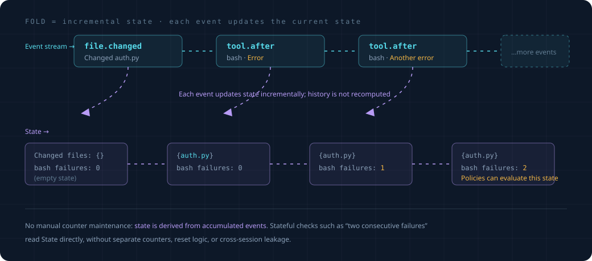

# 事件与状态（地基）

这是整层最底下的两块砖：**事件**长什么样，**状态**怎么从事件累加出来。
overview 里点到为止，这里讲透。读这篇前先读完 `overview.md`。

## 1. 事件长什么样

一条事件就是一个小数据包，记着"刚刚发生了一件什么事"。字段如下：

```python
@dataclass
class Event:
    id: str            # 这条事件的唯一编号
    ts: float          # 发生时间（时间戳）
    type: str          # 什么类型的事，见下表
    origin: str        # 谁引起的：user / agent / tool / proactive / system
    session_id: str    # 属于哪个会话
    payload: dict      # 这类事件的具体内容（命令是什么、改了哪个文件……）
```

`type` 可能的值（开放集合，可以再加）：

| type | 什么时候产生 | payload 里有什么 |
|---|---|---|
| `user.prompt_submitted` | 用户发了消息 | 消息文本 |
| `model.response_started` | 模型开始回复 | — |
| `model.response_completed` | 模型回复完 | 回复文本、是否声称完成 |
| `tool.before` | 工具即将执行 | 工具名、参数（如命令字符串） |
| `tool.after` | 工具执行完 | 工具名、结果、是否出错 |
| `file.changed` | 某文件被改 | 文件路径 |

`origin` 这个字段很重要，记着"这件事是谁引起的"。大多数事件是 user / agent / tool 引起的，
但**框架自己出手时也会产生事件**（比如它弹了个提醒，就记一条 `origin=proactive` 的事件）。
为什么要区分？因为框架自己产生的事件，不能反过来又触发框架出手，否则会绕成死循环——
这个底线在 `invariants.md` 讲。

## 2. 事件从哪来

事件不是凭空写的，是把 agent 干活过程中**本来就发生的事**翻译成统一格式。你的框架现在
已经在这些位置"知道"事情发生了，只是没统一记成事件：

- 工具执行前后，`agent_loop` 本来就会向总线 emit `tool.before` / `tool.after`。
- 模型流式回复时，本来就有"开始/结束"的信号。
- 用户发消息进来，dispatcher 本来就在处理。

proactive 层做的，就是在这些已有的点上，把发生的事**翻译成一条 Event，丢进事件流**。
（具体在哪几行接，是实现细节，见 [实施规划](../plans/proactive-implementation.md)。）

## 3. 事件流：一条只往后记的流水账

所有事件汇成一条**流**——按发生顺序排好，只往后追加，已经记下的不改。

"只往后记、不涂改"这个性质（英文叫 **append-only**）带来一个很舒服的结果：**任何时刻的
"当前状况"，都能由这条流从头算出来。** 这就引出下一块——状态。

## 4. 状态：把事件流累加成"当前状况"

### 4.1 fold 是什么

规则做判断时，经常不只看眼前这条事件，还要看"积累下来的状况"——改了哪些文件、某工具
失败几次、模型是不是刚说了完成。这个"状况"不单独存，而是**从事件流算出来**。

算的方式叫 **fold**（滚雪球）：从一个空状况开始，事件一条条过，每过一条就更新一下状况，
过完就是当前状况。

```python
def fold(事件流):
    状况 = 空状况()                    # 雪球从零开始
    for e in 事件流:                   # 一条条滚过去
        状况 = 更新(状况, e)            # 每条事件让雪球长一点
    return 状况                        # 滚完 = 当前状况

def 更新(状况, e):
    if e.type == "file.changed":
        状况.改过的文件.add(e.payload["path"])
    elif e.type == "tool.after" and e.payload["出错"]:
        状况.该工具失败次数[e.payload["工具"]] += 1
    elif e.type == "tool.after" and not e.payload["出错"]:
        状况.该工具失败次数[e.payload["工具"]] = 0   # 成功就清零
    # ... 每种关心的事件，更新对应的状况
    return 状况
```

具体走一遍，看雪球怎么长：



到这里"当前状况"就是 `{改过的文件: {auth.py}, bash失败: 2}`——**没有谁手动维护这个计数，
它纯粹是事件累加的副产品。** 这就是 overview 里说的"事件驱动帮你统一管了记忆"。

### 4.2 规则怎么用状态

规则的 `evaluate` 拿到当前事件**和**当前状态，两个一起看：

```python
class StuckToolWatcher:
    on = {"tool.after"}
    def evaluate(self, event, state):
        工具 = event.payload["工具"]
        if state.该工具失败次数[工具] >= 3:        # 读累加出来的状态
            return 提醒(f"{工具} 连续失败了，可能卡住")
        return None
```

"连续三次失败"这种需要记忆的判断，因为有了 fold 出来的 state，写起来就这么直白。

### 4.3 不用每次从头算

你可能担心：每来一条事件就从头 fold 整条流，流很长不就很慢？

不用。实际实现是**增量**的：维护一份"当前 state"，新事件来了只在它上面更新一步（就是调一次
`更新(状况, e)`），不重算历史。"从头 fold"只是**定义**——它定义了 state 应该等于什么；
增量更新是这个定义的高效实现。两者结果必须一致，这是唯一要守的规矩。

## 5. 一个要注意的坑：多个子任务同时跑

OpenProgram 支持同时跑多个 subagent（后台并行的子任务）。如果它们的事件全堆进一条流、
一起 fold，会串味：子任务 A 改的文件和子任务 B 改的文件混在一个"改过的文件"集合里，
规则就会拿 A 的改动配 B 的情况，判断全乱。

解决办法：**按"哪个执行流"分开 fold。** 每个 subagent 有自己的一份状态，互不污染。事件里
带着"我属于哪条执行流"的标记（用 `session_id` 加一个子任务标识），fold 时按这个分组。

这是这套设计唯一认真处理的并发问题。其余的（崩溃恢复、防篡改）不在范围内。

## 6. 小结

| 概念 | 一句话 | 心智模型 |
|---|---|---|
| 事件 Event | "刚发生了一件事"的小数据包 | 流水账上的一笔 |
| 事件流 | 所有事件按序排好，只往后记 | 不断变长的流水账 |
| fold | 把事件流累加成当前状况 | 滚雪球 |
| 状态 State | 累加出来的"当前状况" | 雪球滚到现在的样子 |

下一篇 `execution-model.md`：规则（Policy）具体怎么写，两类规则（挡路的 / 旁观的）各有什么讲究。
