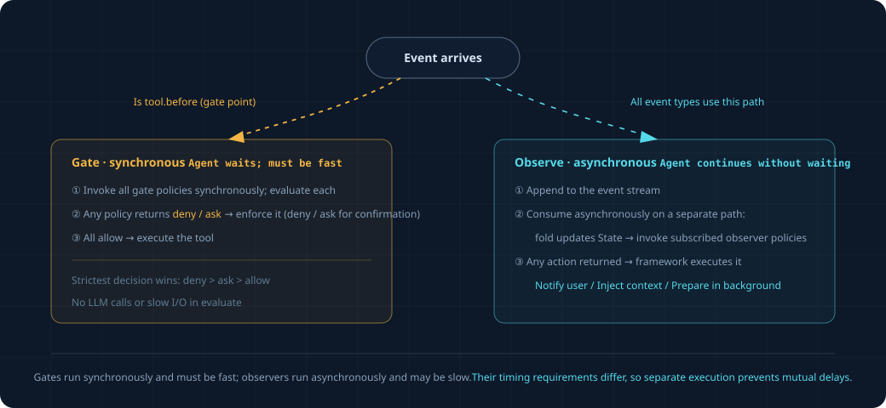

# 规则怎么写、怎么跑

overview 讲了规则（Policy）是什么、分两类。这篇讲细节：一条规则完整长什么样、两类规则
（挡路的 / 旁观的）各有什么讲究、框架怎么调用它们。读这篇前先读完 `overview.md` 和
`events-and-state.md`。

## 1. 一条规则完整长什么样

一条规则就是一个 Python 类，框架认这几样东西：

```python
class Policy:
    on: set[str]          # 我盯着哪几类事件
    lane: str             # 我是"挡路的"(gate) 还是"旁观的"(observer)
    cooldown_s: float     # 我出手后，至少隔多久才允许再出手（防刷屏）

    def evaluate(self, event, state) -> Action | None:
        # 事件来了，看一眼当前事件 + 当前状态，决定出手还是不管
        # 出手就 return 一个 Action；不管就 return None
        ...
```

就这四样。`on` 和 `lane` 是声明（我关心什么、我是哪类），`evaluate` 是逻辑（来了怎么办），
`cooldown_s` 是个防刷屏的简单旋钮。

框架启动时把所有规则**注册**进来，按 `on` 建个索引："tool.before 这类事件来了，该叫醒哪几条
规则"。事件来了，框架查索引，只叫醒关心它的那几条，挨个调 `evaluate`。

## 2. 挡路的（gate）

**在事情发生之前拦住。** 只盯一类事件：`tool.before`（工具即将执行）。因为"拦"只有在事情
还没发生时才有意义——工具都跑完了再拦没意义。

```python
class DangerousCommandGuard:
    on = {"tool.before"}
    lane = "gate"
    cooldown_s = 0

    def evaluate(self, event, state):
        if event.payload["工具"] != "bash":
            return None
        命令 = event.payload["命令"]
        if "rm -rf" in 命令 or "git push --force" in 命令:
            return Gate.ask(f"这条命令有风险：{命令}，确认执行吗？")
        return None
```

挡路规则返回的动作只有三种：`Gate.allow()`（放行）、`Gate.deny(理由)`（拦死）、
`Gate.ask(问题)`（问用户，用户说行才放）。

### 挡路的两条讲究

**一、必须快。** 它挡在工具执行的路中间，agent 在等它给个准话才能继续。它慢，agent 就卡。
所以挡路规则的 `evaluate` 里**不许干慢活**：不调 LLM、不读网络、不读那种要现场推断的复杂
状态。就看眼前事件 + 现成的简单状态，立刻给答案。`DangerousCommandGuard` 就看一眼命令字符串，
快得很。

**二、对子任务也生效。** OpenProgram 现在给 subagent 设了"免批准"（`permission_mode=bypass`），
也就是子任务里的工具不走批准流程。但**挡路规则要绕过这个设置、照样拦**——否则危险命令只要塞进
一个子任务就能溜过去。这正是拦截点位于批准包装之外、而不是之内的原因。

机制上，`tool_gate` 是事件总线上的一个闸门位：`register_tool_gate` 即 `subscribe_gate("tool.before", ...)`，问询走 `EventBus.emit_gate`（`docs/reference/design/proactive/event-layer.md` §3）。同一套闸门派发也承载 `turn.stop`。

## 3. 旁观的（observer）

**在事情发生之后看着，慢慢想，不耽误 agent。** 盯各种事件——工具完成了、模型回复完了、
文件改了。

```python
class StuckToolWatcher:
    on = {"tool.after"}
    lane = "observer"
    cooldown_s = 300                 # 提醒过一次，5 分钟内别再提同一个

    def evaluate(self, event, state):
        工具 = event.payload["工具"]
        if state.该工具失败次数[工具] >= 3:
            return Notify(f"{工具} 连续失败了，可能卡住", severity="info")
        return None
```

旁观规则返回的动作有：

| 动作 | 干什么 |
|---|---|
| `Notify(消息)` | 给用户一个非打扰的提醒（不打断 agent 干活） |
| `Inject(文本)` | 在模型下次思考前，悄悄塞一句提示给模型（不打扰用户） |
| `Prepare(任务)` | 起一个只读后台小任务先做功课，有结论了再决定要不要 Notify |

### 旁观的讲究：可以慢，但别拖慢 agent

旁观规则可以干慢活（甚至调 LLM 判断），因为它不挡路。但有个反向的要求：**它再慢也不能拖慢
agent。** 做法是——agent 该干嘛干嘛、不等它；旁观规则在**旁边一条独立的线**上处理事件。
事件流先记下来，旁观线慢慢消费，agent 这边毫无感知。

`Prepare` 是旁观里最有意思的一招："先做功课再开口"。比如"没补测试"这件事，与其一看到就提醒
（容易误报），不如先起个只读后台任务，让它真去看看这个改动到底缺不缺测试、缺得值不值得提，
有了靠谱结论再 Notify。这个后台任务只读（不许改文件），用现有的后台任务机制跑。

## 4. 框架怎么把这些串起来



## 5. 几个简单的兜底

- **防刷屏**：每条规则有 `cooldown_s`，出手后这段时间内同一情况不再出手。最简单的去重就够了。
- **多条规则撞同一个工具**：挡路时若多条规则都对同一个 `tool.before` 出手，取最严的——
  `deny` > `ask` > `allow`。
- **规则出错**：某条规则的 `evaluate` 抛异常，框架接住、记一笔、当它返回 None（别让一条规则
  的 bug 弄崩整个 agent）。

更复杂的打扰预算、自动熔断、出错时精细的兜底策略**不在范围内**，归档在 `_research_archive/`。
`cooldown_s` 是唯一的旋钮，够把框架跑起来、够加规则。

## 6. 加一条新规则要做什么

这是你以后最常做的事，记住它就行：

1. 写个新类，定 `on`（盯哪类事件）、`lane`（挡路还是旁观）、`cooldown_s`。
2. 写 `evaluate`：看事件 + state，返回动作或 None。
3. 注册进框架。

不用动框架内核，不用碰事件流、fold、落地逻辑。框架内核稳定，能力靠加规则长出来——
这正是"做一个框架"而不是"挂几个钩子"的意义。
