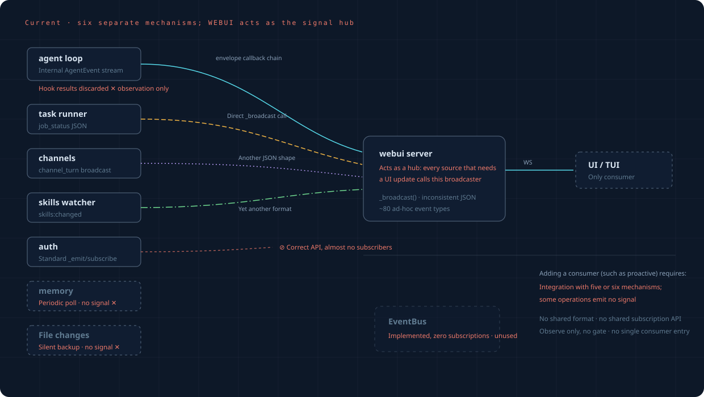
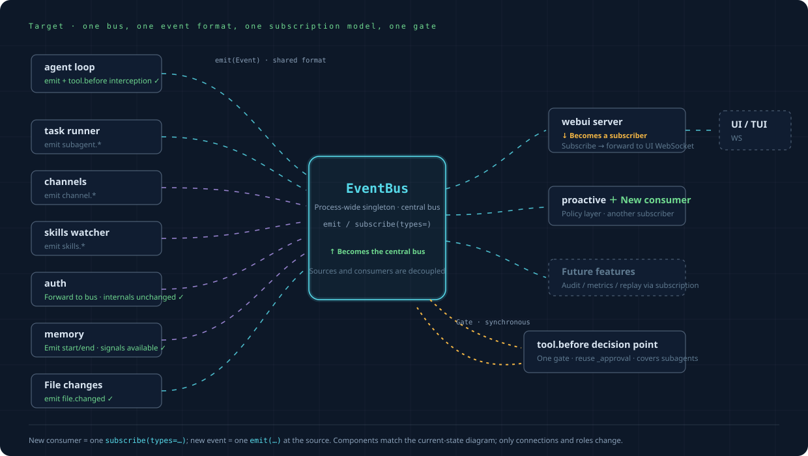

# Framework Signal Routing: One Bus as the Hub

The event layer (`event-layer.md`) defines what an event is. This document covers the
consequence for the framework as a whole: which component routes signals, what each
subsystem contributes to the bus, and which parts of the framework the design leaves alone.

## 1. The Problem the Bus Solves

Without a bus, a signal exists for one purpose only: letting the frontend see it. That
purpose wires every signal straight into the webui server's `_broadcast` — job_status,
channel_turn, and skills:changed each connect with their own JSON, while agent events
arrive through the dispatcher callback chain. webui is a UI component, so making it the
routing point puts a UI concern in the framework's signal path. The gaps are worse than
the coupling: auth models its events correctly but almost nobody subscribes to them,
memory and file changes emit no signal at all, hook return values are discarded (a hook
can observe but cannot intercept), and the EventBus goes unused.

The cost lands on any new consumer. proactive is the first, and without the bus it would
have to integrate with five or six separate mechanisms — and for some moments there is no
signal to integrate with at all.

## 2. The Bus as the Hub: Three Roles

| Role | Who | What the role is |
|---|---|---|
| **Hub** | EventBus | The sole routing point: a process-level singleton, one unified Event format, subscription by type |
| **Subscriber** | webui server | An ordinary subscriber: subscribe to the bus, forward to the frontend WS |
| **Subscriber** | proactive and any future feature | Also just a subscriber, plugging in with one line of `subscribe(types=…)` |

Alongside the bus sits one synchronous interrogation point, `tool.before` — the only
interception site in the framework. It reuses `_approval` and takes effect for subagents.
Every other interaction with the bus is asynchronous observation.

## 3. What Each Subsystem Contributes

| Subsystem | Its role in the bus design |
|---|---|
| agent loop | Keeps its internal AgentEvent stream, and emits to the bus at key points; `tool.before` carries the synchronous interrogation |
| dispatcher | Keeps its on_event callback chain, and emits `user.prompt_submitted` and related events |
| task runner | Emits `subagent.*`; the frontend broadcast comes from webui subscribing and forwarding |
| auth | Unchanged internally; a bridge translates AuthEvent into Event and emits it onto the bus |
| context | Emits `context.*` from within its existing callback |
| channels | Emits `channel.*`; the direct frontend connection remains alongside |
| memory | Emits at processing start and end, which turns its periodic poll into events |
| file changes | Emits `file.changed` at `checkpoint_before_edit` |
| plugin hooks | Internally unified onto the bus; hooks remain as a plugin API, wrapped in a subscription layer |
| webui server | Subscribes to the bus rather than receiving direct connections |
| EventBus | The hub itself: type-based subscription plus singleton access |

The auth bridge is worth noting as the general pattern for a subsystem that already models
its events well: the subsystem keeps its own mechanism, and a bridge translates its events
into the unified format. Nothing inside auth needs to know the bus exists.

## 4. Old and New Paths in Parallel

The bus runs **in parallel** with the existing paths rather than replacing them at once.
Each source moves over independently, and each move is verifiable and reversible on its own.

Two properties make this work. Connecting a source to the bus is purely additive: the bus
receives a copy, the old path runs unchanged, and behavior does not move. Switching webui
to a subscriber does touch the old path, so it uses a pass-through envelope — the frames
webui broadcasts are byte-for-byte what they were, so the frontend requires no change and
notices no switch. This is why the design uses an envelope rather than shadow comparison:
identical frames need no comparison.

## 5. What the Design Leaves Untouched

What stays fixed matters as much as what changes. The bus design does not reach into:

- The dispatcher's seven-stage turn orchestration, or the external signature of `process_user_turn`
- session git DAG storage and contextgit
- JobRunner's thread-pool model
- The `ApprovalRegistry` approval mechanism, which the interrogation point reuses rather than rewrites
- AuthStore itself, which is bridged rather than modified
- The frontend WS protocol, which stays transparent to the frontend because webui broadcasts unchanged frames

## Implementation status

The bus is enabled with class-A sources connected, `file.changed` and the `tool.before`
synchronous interrogation point are in place, class-B sources are bridged (auth through
`events/bridges.py`, with context / channels / memory / webui watcher tapping at the
source), and webui is a bus subscriber — five external sources (task runner, sub_agent,
worktree, functions watcher, channels) emit `ws.frame` events instead of importing webui.
The remaining work is the proactive rule layer, which consumes the bus and adds no new
sources.

> Visual version: [`framework-evolution.html`](framework-evolution.html).
