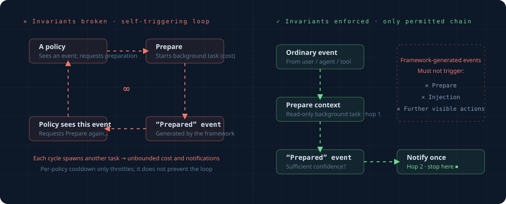

# Invariants the Framework Must Enforce Itself

Rules are something you write, and they change; but there are a few invariants that **the framework core must enforce forever** — no rule, written by anyone, may break them.
There are two, and both are straightforward. Read `overview.md` before reading this one.

(Note: a few further invariants concerning adversarial safety and tamper resistance belong to the research/production level. They are out of scope here and are documented in `_research_archive/threat-model.md`, which is where security hardening would start.)

## Invariant 1: The framework must not trigger itself and spiral into an infinite loop

This is the most important one — bad things happen if it isn't enforced.

### What the problem looks like

Recall: when the framework acts on its own, it also produces events (mentioned in overview concept 1, `origin=proactive`).
For example, an observer rule kicks off a `Prepare` background task, and when that task finishes it produces a "ready" event.

If we ignore where this event came from, it gets seen by some rule, triggers another `Prepare`, produces another "ready" event...



Every `Prepare` is a real, costly background task (possibly an LLM call). Spiraling into an infinite loop = burning money endlessly and spamming the user.

### How it's enforced

**Events the framework produces itself (`origin=proactive`) must not trigger any action that "produces a new event" or "interrupts the user."**

Concretely, we define a very short chain that is allowed to run only once:

```
normal event (caused by user/agent/tool)
   → an observer rule may kick off one Prepare (do its homework)
   → Prepare completes and produces a "ready" event
   → this event is allowed to do exactly one thing: decide whether to Notify (alert the user)
   → and that's it: no more Prepare, no more injection
```

The implementation is simple: every event carries a flag recording "whether this causal chain was started by the framework itself." Before letting a rule act, the framework checks this flag — if the framework started the chain, the event is only allowed to reach "notify once" and is not allowed to propagate any further.

```python
def allow_action(event, action):
    if event.started_by_framework:
        # On the framework's own chain, only one user notification is allowed — no more background tasks / no more injection
        return action is Notify and chain_within_one_hop
    return True   # normal event, act freely
```

This invariant is **framework-level**: rules cannot disable it or work around it. It is part of the foundation.

## Invariant 2: Blocking rules must not be auto-silenced because the user "got tired of" them

This invariant constrains a capability the framework does not yet have, so it reads as a rule for whoever adds that capability.

Logic like "if the user keeps ignoring some alert, automatically alert less" (auto-silencing) **must exclude blocking rules** — safety guardrails (e.g. intercepting dangerous commands) must not auto-disable just because they "got rejected too many times."

Picture the counterexample: someone (or injected malicious content) lures the agent into repeatedly triggering dangerous-command confirmations and repeatedly clicking reject. If that could make the guardrail "think it's useless" and auto-silence itself, then the next genuinely dangerous command would have no one to intercept it.

So the principle is: **auto-silencing applies only to "observer alerts" and never touches "blocking guardrails."** The framework's only interruption control is the simple `cooldown_s`; any silencing mechanism added on top of it inherits this constraint.

## Summary

| Invariant | In one sentence | Why |
|---|---|---|
| No self-triggered infinite loop | Events the framework produces itself reach "notify once" at most, and may not propagate further | Otherwise: endless money burn and spam |
| Guardrails not auto-disabled | Future auto-silencing applies only to alerts, never to blocking guardrails | Otherwise the safety guardrail can be rejection-spammed into uselessness |

These two are guaranteed by the framework core; rule authors don't need to worry about them and can't change them.
