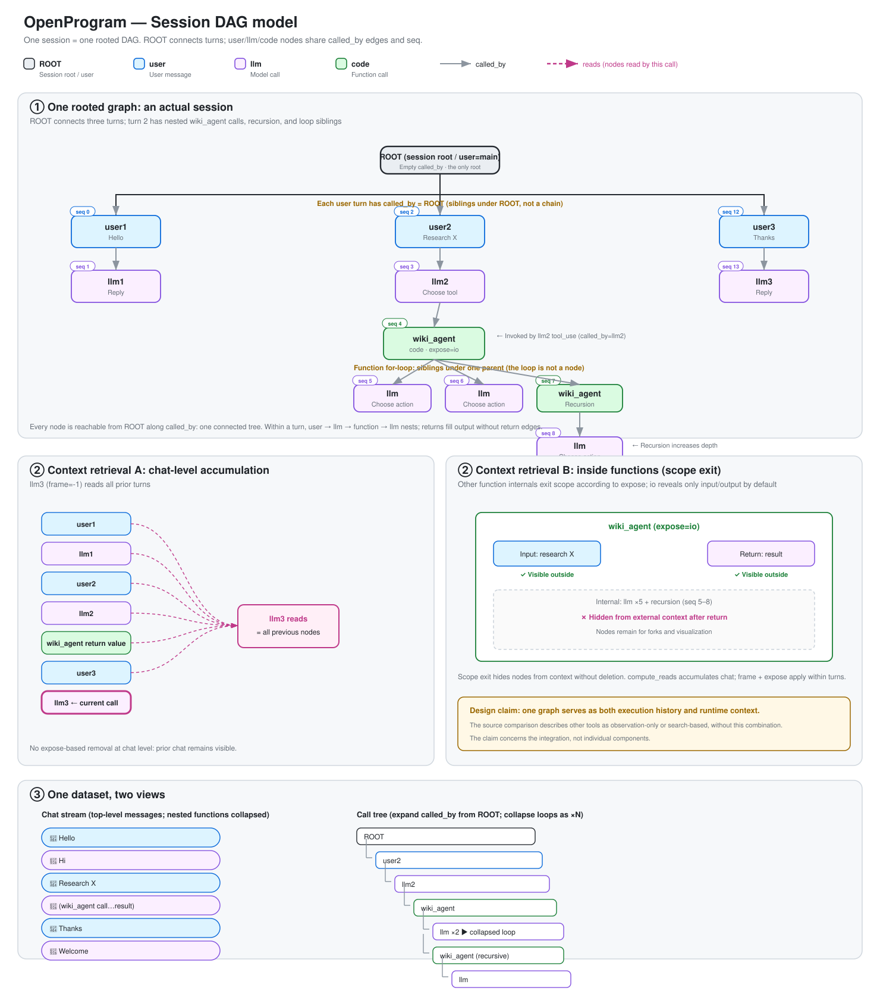

# Session DAG — Design

> This document is the authoritative design of the agent execution record: the
> data model, its edges and invariants, branching and spawn, context rendering,
> context assembly, and compaction. For the rationale behind choosing this model,
> see [`../../research/execution-trace-model-selection.md`](../../research/execution-trace-model-selection.md).
> For the call-flow diagram, see [`../agent-call-flow.svg`](../agent-call-flow.svg).
> The visual rendering spec (layout, edges, legend, default visibility) is
> [`rendering.md`](rendering.md) — that file stays authoritative for
> drawing; this file covers semantics only.



## 1. Overview and Motivation

An entire session is **one single DAG with a unique root**. Every user message,
every LLM call, every function call is a node in the same graph, sharing one
monotonically increasing `seq`. The graph is simultaneously:

- the **persistence record** — the only durable account of what happened;
- the **runtime context** — every LLM call's context is a rendering of one
  path through this graph;
- the **display source** — chat transcript, call tree, and minimap are all
  projections of the same nodes.

This fusion is the point of the design. Observability stacks (LangSmith,
Datadog) split each request into an independent trace and group traces with a
session tag, because they only observe after the fact and never read the record
back. This system does read it back: `render_context` retrieves history by
walking the same graph under the same `seq`, so turns must live in one connected
graph. A unique root plus a shared `seq` is the hard constraint that makes it
one graph — without the root, each top-level node would be an isolated root of
its own disconnected graph.

What is claimable as novel is the fusion itself: the recorded call tree *is*
the runtime context, each call queries it by frame scope + per-function expose,
and all nodes are retained for fork and replay. The individual ingredients
(ContextVar call-stack tracking, graph forking) are common; the whole is not.

## 2. Data Model

### Node (Call)

One data structure covers everything. An LLM call is always the same kind of
`llm` node whether the user or a function triggered it.

```
Call:
  id           unique identifier
  seq          monotonically increasing integer, global temporal order (the sole sort key)
  created_at   wall-clock (for humans, not for sorting)

  role         "user" | "llm" | "code"   ← determines rendering, not essence
  name         model id / function name / user name

  input        prompt / function args / None
  output       reply / return value / user text
  status       running | completed | error | cancelled

  caller       who invoked me (sub-call parent id); empty on nodes that were not sub-called
  predecessor  who came before me in the chat (conversation-chain parent id);
               top-level schema field — the ONLY place this edge lives
  reads        which nodes this LLM call read (references for rendering, not a structural edge)
  metadata     token usage / model / source / expose / tool_call_id …
               LLM leaf fields align with gen_ai.*
```

Defined in `openprogram/context/nodes.py`.

### The three roles and ROOT

| Scenario | role | caller | predecessor |
|---|---|---|---|
| Session root (ROOT) | user (special, `display=root`) | empty | empty |
| User sends a message | user | ROOT | previous turn's llm reply; `"ROOT"` sentinel on the session's first node |
| LLM reply | llm | this turn's user (top-level) or the enclosing code node | this turn's user |
| LLM calls a tool | code | that llm node | — |
| User manually calls a function | code | empty | current branch head (or `"ROOT"` at root level) |
| Function calls an LLM / sub-function | llm / code | the enclosing code node | — |

Loops are not nodes: a loop running N times is N siblings under the same parent
(ordered by `seq`); visualization may fold repeats into ×N, but the data keeps
all N nodes. A function call is exactly one code node — no anchor, placeholder,
or auxiliary node ever accompanies it.

### Status vocabulary

One set for all nodes: `running | completed | error | cancelled`. Chat and
function paths use the same vocabulary; error nodes carry structured
type/trace metadata, and a user cancel writes `cancelled`, never `error`.

## 3. Edges and Invariants

### Two edges, never conflated

| Edge | Field | Meaning | Who has it |
|---|---|---|---|
| **Sub-call edge** | `caller` | who invoked me to execute | only genuinely sub-called nodes; a normal top-level assistant reply leaves it empty |
| **Conversation-chain edge** | `predecessor` | who I follow in chat order | user / llm nodes |

Both are directed and acyclic. `caller` makes all top-level nodes converge onto
ROOT (one connected graph); `predecessor` expresses chat order and
distinguishes branches. They are orthogonal:

```
One graph (shared seq, unique root). Each node: caller(C) / predecessor(P)
ROOT
├ user1  seq0  C=ROOT  P="ROOT"   ┐ top-level users hang on ROOT via caller;
│  └ llm1 seq1 C=user1 P=user1    │ conversation order chains via predecessor:
├ user2  seq2  C=ROOT  P=llm1     │   user2.P=llm1, user3.P=llm2
│  └ llm2 seq3 C=user2 P=user2    │ a fork = one predecessor with multiple
├ user3  seq4  C=ROOT  P=llm2     ┘ conversation children
```

Why two edges: forks must be distinguished by `predecessor`. When the user
retries a message, two children sprout at the same position; `seq` alone cannot
tell which child follows which branch line. A single-edge model (caller + seq)
cannot express branching.

### `predecessor` is a schema field

`predecessor` is a top-level field on `Call` — the only storage location.
Serialization writes it top-level; there is no metadata mirror and no legacy
read path. Enforcing the edge in the schema, rather than validating metadata
after the fact, is what makes readers able to rely on it: a mislinked branch
cannot be un-corrupted by a linter, so the append path must refuse to create
one.

### Write invariant

Enforced in the store's append path (`openprogram/store/session/session_store.py`):
**every ROOT-level conversational node (role user/llm, no real caller) must
carry a `predecessor`.** A violating append raises `PredecessorMissingError`
instead of silently forking the session at ROOT. The legal exceptions:

- the **session's first node** and **explicit root forks** — these carry the
  sentinel `predecessor="ROOT"` (not empty), so retrying the first message
  creates a legitimate ROOT-level sibling that the invariant admits;
- **spawn branch roots** — created only through `spawn_branch()` (§4), with
  `predecessor=None` and `caller` pointing at the spawning node;
- **`ask_user` answer nodes** — a user node with non-None `input` is a callee
  reply inside a call, not a conversational turn;
- **compaction summary nodes** — legal chain members per §8.

### Read invariant

`get_branch` and `list_branches` walk edges only — no caller fallback, no seq
stitching, no heuristics. A node without a `predecessor` must be a legal branch
terminus (spawn root, ROOT itself, or the session's first node); anything else
is broken data and raises `BrokenPredecessorChainError` with the offending node
id. Broken data surfaces; it is never guessed around.

## 4. Branches and Spawn

### Fork

A branch is an alternative possibility at the same position. **A branch node's
`predecessor` equals that of the node it replaces** — the same predecessor
having multiple conversation children is a fork. No special node type exists:

| Scenario | Replaced node | Branch node | Shared edge |
|---|---|---|---|
| User resends a message | user2 (P=llm1) | user2' (P=llm1) | predecessor |
| LLM retry | llm1 (P=user1) | llm1' (P=user1) | predecessor |
| Tool retry | code (C=llm1) | code' (C=llm1) | caller |

### Failure and retry

**An error is a terminal state, not a missing one.** A turn that raises is
finalized exactly like one that succeeds: the node is written with
`status=error`, the turn is committed to git, and head stops on the error node.
The failed turn is a fact about the session, and the record says so.

Skipping finalization on the error path would leave the git timeline with a
hole precisely where something went wrong — the one place the history is worth
having. It would also leave a retry forking from a predecessor whose commit was
never written. A user cancel terminates the same way with `status=cancelled`.

The steps that finalization runs on an error path are the ones that keep the
record whole: the git commit, the project commit, the shadow-git commit, and
snapshot eviction. The steps that presuppose a completed reply — context-commit
backfill, usage feedback, auto-titling — are meaningless for a turn that has no
reply and are skipped.

Retry needs no separate mechanism. It is an ordinary fork: the retry node takes
the failed node's predecessor, which is what makes it a sibling rather than a
successor. Two consequences follow from the ordinary rules:

- **The failed line is kept.** The error node stays in the graph and stays
  reachable. Checking out its branch shows exactly what happened.
- **The failed line is not in the retry's context.** `render_context` walks the
  active branch, and the error node is not on it. The retry never sees the
  error it is retrying. Nothing filters by status to achieve this — branch
  isolation already does it.

### Spawn

`SessionStore.spawn_branch(session_id, caller_node_id, *, source, name=…)` is
the **only** way to open a clean spawn root. It creates the branch-root user node
(`predecessor=None`, `caller=caller_node_id`, `metadata.source`,
`metadata.spawn_branch_root=True`), registers it as head, and returns its id.
Spawn call sites (task runner, collaboration messages, background agents) call
the primitive for clean starts. An inherited spawn is an ordinary exact fork:
its first user node has the requested node as `predecessor`.

A spawn branch root does **not** hang on ROOT: its `caller` points at the node
that initiated it, which keeps the single-connected-graph invariant via that
node. For a cross-session exact fork, source session S retains the attach card
beside its initiating node A, while target session T stores the new user node
with `predecessor=M`, `caller=A`, and
`metadata.spawned_from_session=S`. The graph projection cannot draw an edge to
a node in another session, so it places that external caller at ROOT for the
target view and marks the node `spawn_remote`; the source node is marked
`spawn_out`. The source card points to `attach.session_id=T` and the target
branch head. Cross-session spawning does not move either session's selected
HEAD; the target result is registered as a branch tip, and a later asynchronous
reply-back advances the source HEAD as an ordinary turn.

Spawn branches have clean context: `get_branch` on a spawn branch stops at the
spawn root and does not leak into the parent branch via the caller edge. The
chat view of a spawn branch shows only the branch's own history. The reverse
is also true: `render_path` from a parent-branch head does not descend into a
spawn branch via `caller` (see §6).

### The completion notification anchors at HEAD

An async sub-agent finishing writes two things back to the session that spawned
it: the attach pointer, which lands on the caller turn because that is where
the call was made, and a notification turn
(`metadata.source = "task_followup"`), which lands at the session's **current
HEAD** and advances it like any other turn.

The two anchor differently because they say different things. The attach
pointer is a record of a call and belongs beside the call. The notification is
a new turn in the conversation and belongs at its end.

This is what keeps N sub-agents from being answered N times over. Anchoring
each notification at the node that spawned it makes them siblings of one
turn — three sub-agents finishing produce three parallel branches, each with
its own reply, and the user who sent one message watches it get answered three
times. Anchored at HEAD they form one chain instead:

```text
… → spawn turn → notice₁ → answer₁ → notice₂ → answer₂
```

The runner leaves `TurnRequest.branch_from` at `INHERIT_PARENT` and never
rewinds head before dispatching, so the dispatcher's ordinary append path does
the anchoring. Concurrency is handled by one lock per delivery session
(`JobRunner._followup_lock`): two sub-agents finishing in the same millisecond
still take their turns in sequence, and the second reads a HEAD that already
includes the first answer.

## 5. Head Pointer and Branch Management

- **head**: the session tracks a `head_id` — the tip of the currently active
  branch. Every write path advances it to a real node id; after a function call
  completes, head moves to the actual code node, never to a placeholder. A
  dangling head would make the branch walk unreachable and render an empty
  session.
- **get_branch(session_id, head_id)**: walks the predecessor chain from head to
  its terminus and returns the linear history of that branch.
- **list_branches(session_id)**: enumerates leaves in the conversation
  predecessor graph. Conversation nodes include user and LLM turns plus
  top-level Program actions whose caller is empty or `ROOT`. A node with any
  such successor is an ancestor, not another branch tip. Internal execution
  children, runtime/attach rows, and context rows do not continue the
  conversation and therefore do not remove their owner's tip. Parallel
  top-level Programs sharing one predecessor remain separate leaves. There is
  no special main-tip fallback: merged and non-conversation nodes stay excluded.
  Branch names live in session meta under `branches: {head_id: name}`.

## 6. Context Rendering

All context is retrieved from the graph through `render_context`. A single
rule determines which nodes enter the context:

> **A node is rendered if and only if its nearest ROOT-level ancestor (walking
> `caller` edges upward) lies on the predecessor chain of `head_id`, and the
> frame/expose rules admit it.**

Concretely, `render_context` walks the predecessor chain from `head_id` back
to the start of the branch, producing the branch spine; for each spine node it
then filters that node's caller-subtree through the frame and expose rules,
and the surviving nodes enter the rendering. `seq` is used only for ordering
and plays no part in this selection. Branch isolation is therefore an inherent
property of the walk — the engine performs no filtering of its own after
retrieval. The engine does exactly three things: resolve the head, call
`render_context`, and pass the result to `render_dag_messages` for translation
into provider messages.

ROOT is not a ROOT-level ancestor. Every top-level conversational node
carries `caller="ROOT"` (§3, which is what keeps the graph connected), so
expanding ROOT's caller-subtree would re-admit every sibling branch in the
session. A ROOT-level node is its own nearest ROOT-level ancestor; the walk
never expands ROOT itself.

Spawn-branch roots (`metadata.spawn_branch_root`) are likewise not entered via
the `caller` edge. A spawn branch is its own conversation; its result returns
through the return value / attach pointer. Expanding a spawn root from the
parent spine would leak the spawned instructions and verdicts into the
spawning branch (for example a Goal working agent reading its judge). The
exclusion is directional: rendering from a head inside the spawn branch still
sees the branch itself via the spine.

Frame semantics:

- **Top-level chat** (frame = −1): every spine turn is fully visible —
  accumulation; all prior turns of the branch are fed in, flat.
- **Inside a function** (frame = that code node's seq): pre-frame history plus
  the function's own in-frame progress are visible; other functions' internals
  are popped per their `expose` setting (`io` by default exposes only
  input/output).

The primitive is **pure**: no disk writes on the read path. Anything that must
touch disk (large-node spill) happens on the write path (§8).

Rendering tool nodes: a code node carrying `metadata.tool_call_id` (model
tool_use) renders as a real ToolCall/ToolResult pair grouped into its owning
llm node's assistant message; a code node without one (direct function call)
renders as a text pair. Two views project the same data: the chat stream
(top-level user + llm by seq, nesting folded) and the call tree (fully expanded
along `caller`, loop siblings folded ×N).

## 7. Context Assembly

### One system prompt, one assembler

There is a single project-wide system prompt (identity + project memory +
unified tool list + skills), produced by **one assembler** —
`context.build_system_prompt(agent_profile, tools, mode)` — and shared by every
model call, whether top-level chat or inside a function body. The budget counts
the exact string that ships; assembler output equals wire output.

The prompt is constant by default from session start to finish. A constant
prefix maximizes provider KV-cache hits, and a model inside a function gets the
same project background as the chat model. Consequences:

- **Not split** into a chat prompt and a function prompt.
- **No mutable tail segment**: the tool list is unified too; once it varies per
  call site, the prefix varies and long-context caching collapses.
- **Exceptions are a usage-layer choice**: an individual call that wants a slim
  system prompt declares it explicitly at the call site, deliberately accepting
  the cache miss.
- Preventing wrong tool use inside a function (e.g. self-recursion) is solved
  by situational guidance at the start of the user turn plus a recursion-depth
  cap — never by varying the system tool list. See
  [`../execution/agentic-self-recursion.md`](../execution/agentic-self-recursion.md).

### The prompt is recorded, not implied

Whenever the assembled prompt's hash changes (session start, toolset change,
plan-mode toggle), the store appends a `role=code` node
`name="context/system_prompt"`, `caller=ROOT`, output = the full text, on the
current branch. Rendering pins the latest such node on the spine as the wire
system message. Replaying any historical call reproduces the prompt that was
actually sent. No fourth role is introduced; `context/*` names are reserved and
hidden from the chat transcript (the same mechanism that hides summary nodes).

### Memory prefetch lives in the user turn

Prefetched memory renders as a prefix block inside the **current user node's**
wire message and is stored in that node's metadata (`memory_prefetch`). The
system prompt and tools segment stays byte-stable across turns (history
cache-hits), and replay sees exactly what the model saw. The block is not aged;
it dies with its turn like any other user content.

### Multimodal content

Images and files are node content, no different from text — no injection hook.
The node stores a reference (the body lives in the attachments directory), so
content is complete without bloating the search index. `render_context`
fetching a node fetches all of its content; render loads the image by
reference.

## 8. Compaction and Aging

### Summary nodes join the chain

Compaction is an append-only insert. A summary node is `role=llm`,
`name="context/summary"`, `predecessor` = the predecessor of the first node it
covers, `metadata.covers_ids` = the exact chain nodes it replaces (ids, not a
seq interval — sibling branches interleave seqs). Nothing else changes: the
kept tail keeps its ids and predecessors, no edges are rewritten, and HEAD
stays put (the append rule only advances on chain extension). Rendering
applies segment substitution (context/compaction.md §3): a chain that
contains the whole covered segment renders `[summary, kept tail…]`; any other
chain renders raw. Compaction is a rolling summary — each new one absorbs the
previous, `extra_meta._last_summary_id` marks the only active one, and
superseded summaries are inert relics.

The WebUI payload carries `covers_ids` on the summary row, extended with the
caller subtrees of covered turns (`webui/graph_builder.py`), so the renderer
draws the capsule and its fold without doing seq arithmetic — see
dag/rendering.md §9. Full specification: context/compaction.md.

### The aging boundary only advances; rendering is exactly replayable

The tail-turns aging boundary advances only at turn commit, never mid-turn (a
per-call rolling boundary breaks the cache prefix every call). Each llm node
records `metadata.render_manifest = {policy_version, aged_before_seq,
spilled: [...]}` at the moment the call is made. Replaying a call means
rendering with the manifest's recorded policy, not today's — the same graph
renders the same bytes on any day.

### Spill on write, one pipeline

A node larger than the spill threshold is spilled to disk when it is
**recorded** (once, deterministic), never when it happens to be rendered — the
read path stays side-effect-free, as §6 requires. The DAG render is the **only**
context pipeline: there is no fallback assembly path. If the render raises, the
turn fails visibly with the error. Silent fallbacks hide broken pipelines; loud
failure is the feature.

## 9. Storage Layer

Sessions persist in a git-backed store (`openprogram/store/session/`):

- one `GitSession` per session on disk under `<state>/sessions/<id>/`;
- one in-memory `SessionMemoryIndex` per session, lazy-loaded, holding the
  node-by-id / children-by-predecessor indexes the walks use;
- `head_id` and branch names live in the session's `meta.json`;
- the store persists raw nodes + meta only; context commits belong to the
  commit subsystem.

The function body of an `@agentic_function` runs in a **spawned** subprocess
(fresh interpreter, not fork — the parent has PyTorch/libomp loaded and a fork
would SIGSEGV on the child's first BLAS call), so stop can SIGKILL the process
group. The subprocess writes its code subtree through its own SessionStore; the
parent invalidates its cache after execution to read the on-disk truth. The
SessionStore code subtree is the single source of truth for a function call;
the real-time WebSocket frame and the refresh load are both projections of it
and must produce the same card.

## Appendix: Implementation Status

Every section of this document is implemented. The data model, edges,
invariants, spawn primitive, edge-pure branch walks (§2–§5), §6 path-native
membership, §7 (single assembler, `context/system_prompt` nodes,
memory-prefetch relocation), and §8 (`covers_ids`-based summary nodes, the
advance-only aging boundary, render manifests, write-path spill,
single-pipeline enforcement) all hold in code; `openprogram/context/nodes.py`,
`openprogram/context/components.py`,
`openprogram/context/system_prompt_node.py`,
`openprogram/context/aging.py`, `openprogram/context/spill.py`, and
`openprogram/store/session/session_store.py` are authoritative for details.

Compaction therefore no longer needs its exemption from the write invariant:
a summary node carries the predecessor of the range it covers and enters the
chain like any other node. `context/summary` is the one `context/*` name that
stays visible to the chat views, because its output is real conversation
content standing in for the range it replaces rather than pipeline machinery.

Five environment switches exist for ablation, all read at call time so a run
can move one variable without a reimport: `OPENPROGRAM_TOOL_AGING`,
`OPENPROGRAM_TOOL_AGING_TAIL_TURNS`, `OPENPROGRAM_TOOL_AGING_MAX_RESULT_CHARS`,
`OPENPROGRAM_NODE_SPILL`, and `OPENPROGRAM_EXPOSE_DEFAULT` (which moves only
what an unspecified `expose=` means — an explicit one always wins).

## Related Files

- `openprogram/context/nodes.py` — Call schema + render_context, segment substitution
- `openprogram/context/components.py` — the one system-prompt assembler (§7)
- `openprogram/context/system_prompt_node.py` — `context/system_prompt`
  recording + `context/*` hiding (§7)
- `openprogram/context/aging.py` — ratcheted aging boundary + render manifests (§8)
- `openprogram/context/spill.py` — write-path large-node spill (§8)
- `openprogram/context/persistence.py` — `covers_ids`-based summary nodes (§8)
- `openprogram/context/render.py` — render_dag_messages
- `openprogram/store/session/session_store.py` — append invariant, get_branch,
  spawn_branch, list_branches
- `openprogram/agent/dispatcher/__init__.py` — chat entry, agent loop
- `openprogram/agentic_programming/runtime.py` — function-body model calls
- [`rendering.md`](rendering.md) — visual rendering spec (authoritative
  for drawing)
